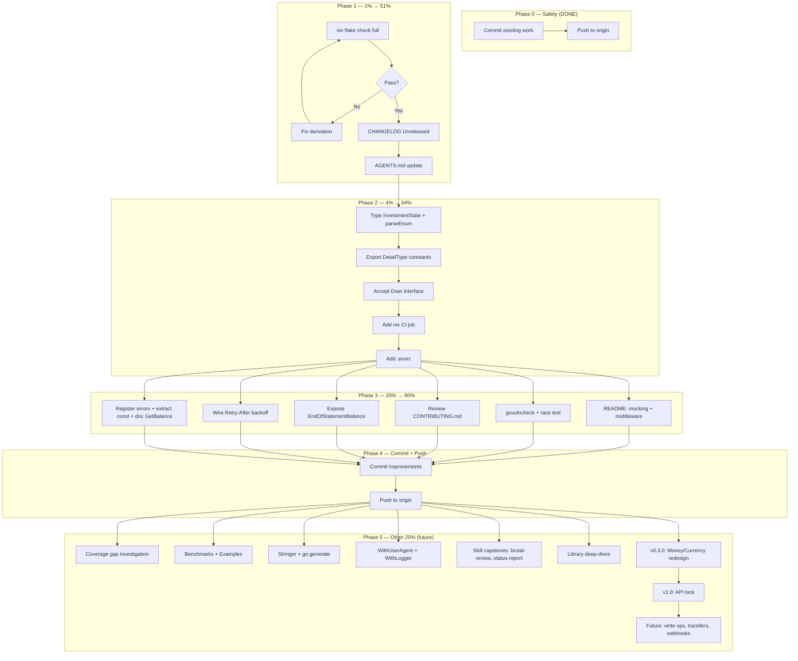

# wise-go — Comprehensive Improvement Plan

> Generated 2026-07-18 19:59 · Pareto-driven · Source: 13-skill review session + brutal self-review

## Context

On 2026-07-18, a comprehensive 13-skill review pass ran over wise-go (code-quality-scan,
deduplicate-code, data-model-review, naming-review, full-code-review, architecture-review,
architecture-visualization, go-modularize, nix-flake-migration, docs-health, update-old-docs,
copywriting, frontend-design). The session produced:

- **4 code fixes** (CARD_PAYMENT classification bug, branded-ID formatting, 4 new tests, UTC docs)
- **8 HTML review reports** + 2 D2 architecture diagrams
- **`flake.nix`** adoption (devShells + checks + treefmt)
- **3 living docs** (FEATURES.md, TODO_LIST.md, ROADMAP.md)
- **README polish** + status-report annotation

This plan takes every finding from every report and every item from the prior session's
50-item TODO list, applies Pareto prioritization, and breaks them into executable tasks.

The codebase baseline: **0 lint issues, 0 duplication clones, 94.8% test coverage, build/vet/test/lint all green.**

---

## Pareto Breakdown

### The 1% that delivers 51% of the result

These are the safety-critical, visibility-critical, and context-critical items. Without them,
everything else is at risk or invisible.

| ID  | Task                                                        | Why it's the 1%                                                                                                                                                        |
| --- | ----------------------------------------------------------- | ---------------------------------------------------------------------------------------------------------------------------------------------------------------------- |
| C1  | Run full `nix flake check` (not `--no-build`), fix failures | Without this, the flake gives false confidence. A broken flake is worse than no flake.                                                                                 |
| C2  | Update CHANGELOG `[Unreleased]` with 2026-07-18 fixes       | Without this, the CARD_PAYMENT bug fix is invisible in release notes. Downstream users won't know to upgrade.                                                          |
| C3  | Update AGENTS.md with flake.nix workflow + new gotchas      | Future AI sessions need to know about flake.nix (buildflow hook requires flake.nix git-tracked), the CARD_PAYMENT classification fix, and the UTC timezone assumption. |

### The 4% that delivers 64% of the result

Zero-risk internal improvements that eliminate entire categories of potential bugs.

| ID  | Task                                                                  | Why it's the 4%                                                                                                                               |
| --- | --------------------------------------------------------------------- | --------------------------------------------------------------------------------------------------------------------------------------------- |
| D1  | Type `InvestmentState` + generic `parseEnum[T]` helper                | Eliminates the untyped-string-constant smell AND the duplicated switch-parser pattern in one move. Internal-only, zero API break.             |
| D2  | Export `DetailType` constants for `ListTransactionsRequest.Type`      | The valid filter values are currently undiscoverable (unexported constants). Exporting them costs nothing and makes the API self-documenting. |
| D3  | Accept `Doer` interface in `WithHTTPClient` instead of `*http.Client` | `*http.Client` satisfies `Do(req) (*Response, error)` implicitly. Backward-compatible. Unlocks mocking for downstream users.                  |
| D4  | Add nix CI job to `.github/workflows/ci.yml`                          | Ensures the flake doesn't drift. Without CI, the flake is a local-only artifact that rots silently.                                           |
| D5  | Add `.envrc` for direnv                                               | `use flake` — one line, zero maintenance, makes `nix develop` automatic on `cd`.                                                              |

### The 20% that delivers 80% of the result

User-facing documentation, security verification, and data-surfacing improvements.

| ID  | Task                                                           | Why it's the 20%                                                                                         |
| --- | -------------------------------------------------------------- | -------------------------------------------------------------------------------------------------------- |
| E1  | README: "Mocking the client" section                           | Every downstream user who writes tests will need this. Prevents a class of support questions.            |
| E2  | README: "Request middleware via WithHTTPClient" section        | Shows how to add tracing/logging. Closes the "middleware gap" from the architecture review.              |
| E3  | Run `govulncheck ./...` locally                                | CI runs it; we should catch vulnerabilities before CI does.                                              |
| E4  | Run `go test -race ./...` locally                              | CI uses `-race`; local verification should match.                                                        |
| E5  | Review `CONTRIBUTING.md` for drift                             | 11.5 KB file never opened this session. May reference outdated patterns.                                 |
| E6  | Expose `EndOfStatementBalance` on `ListTransactionsResponse`   | Wise returns it; the SDK decodes it and throws it away. Zero-cost data the caller wants.                 |
| E7  | Wire `Retry-After` into failsafe-go backoff policy             | Currently parsed but not used to inform backoff delays. Affects rate-limit recovery time.                |
| E8  | Register error types with `errorfamily.RegisterClassification` | `go-error-family v0.6.1` exposes this API; wise-go doesn't use it yet. Enables CLI-level error handling. |
| E9  | Extract `wiseDateFormat` constant from `parseWiseDate`         | Magic string `"2006-01-02 15:04:05"` repeated in tests.                                                  |
| E10 | Document `GetBalance` O(n) cost in doc comment                 | Callers should know this calls ListBalances + linear scan.                                               |

### The other 20% (to reach 100%)

Long-tail quality polish, deep investigations, and future-release preparation.

| ID  | Task                                                                        | Category             |
| --- | --------------------------------------------------------------------------- | -------------------- |
| F1  | Investigate 5.2% coverage gap (`go tool cover -func`)                       | Quality              |
| F2  | Add benchmarks for `Cents()`, `classifyTransactionType`, `mapTransaction`   | Performance          |
| F3  | Add `Example_*` test functions for godoc                                    | Documentation        |
| F4  | Add `fmt.Stringer` for `ProfileType`, `BalanceType`, `TransactionType`      | Developer experience |
| F5  | Consider `go:generate` for enum string-to-value maps                        | Maintainability      |
| F6  | Add `WithUserAgent` option                                                  | Feature              |
| F7  | Add `WithLogger` option for structured debug logging                        | Feature              |
| F8  | Run `brutal-self-review` skill                                              | Quality              |
| F9  | Run `status-report` skill (capstone HTML dashboard)                         | Documentation        |
| F10 | Run `library-deep-dive` on failsafe-go                                      | Quality              |
| F11 | Run `library-deep-dive` on go-branded-id                                    | Quality              |
| F12 | Run `library-deep-dive` on go-error-family                                  | Quality              |
| F13 | Run `bdd-testing` skill to expand Ginkgo contexts                           | Quality              |
| F14 | Add integration test skeleton behind `--live` build tag                     | Testing              |
| F15 | Consider splitting `internal_test.go` by domain                             | Maintainability      |
| F16 | Add `GetProfile` method if Wise supports it                                 | Feature              |
| F17 | v0.3.0: Introduce `Money` + `Currency` types (breaking)                     | Data model           |
| F18 | v0.3.0: Normalize enum casing (breaking)                                    | Data model           |
| F19 | v0.3.0: Reconcile `TransactionTypeUnknown` (breaking)                       | Data model           |
| F20 | v0.3.0: Drop `Result` suffix or move raw types to `internal/raw` (breaking) | Naming               |
| F21 | v1.0: Remove `ListTransactionsResponse.HasMore` (breaking)                  | Data model           |
| F22 | v1.0: Lock the public API; write stability policy                           | Process              |
| F23 | Future: Write operations (POST/PATCH/DELETE helpers)                        | Feature              |
| F24 | Future: Transfers, recipients, quotes resources                             | Feature              |
| F25 | Future: Webhook signature verification                                      | Feature              |

---

## Coarse Plan — 30 to 100 min tasks (sorted by impact/effort)

| #   | ID        | Task                                                       | Impact   | Effort    | Customer Value                                 |
| --- | --------- | ---------------------------------------------------------- | -------- | --------- | ---------------------------------------------- |
| 1   | C1        | Run full `nix flake check`, fix failures                   | Critical | 30 min    | Confidence in reproducibility                  |
| 2   | C2+C3     | CHANGELOG [Unreleased] + AGENTS.md update                  | Critical | 30 min    | Downstream visibility + future session context |
| 3   | D1        | Type `InvestmentState` + generic `parseEnum[T]`            | High     | 30 min    | Type safety; eliminates duplicated parsers     |
| 4   | D2        | Export `DetailType` constants                              | High     | 30 min    | API discoverability                            |
| 5   | D3        | Accept `Doer` interface in `WithHTTPClient`                | High     | 30 min    | Mocking unlock for downstream                  |
| 6   | D4        | Add nix CI job to ci.yml                                   | High     | 30 min    | Prevent flake drift                            |
| 7   | E1+E2     | README: mocking + middleware sections                      | Medium   | 40 min    | User-facing docs                               |
| 8   | E3+E4     | Run govulncheck + go test -race                            | Medium   | 30 min    | Security + concurrency safety                  |
| 9   | E5        | Review CONTRIBUTING.md for drift                           | Medium   | 30 min    | Doc accuracy                                   |
| 10  | E6        | Expose `EndOfStatementBalance`                             | Medium   | 30 min    | Data the caller wants                          |
| 11  | E7        | Wire Retry-After into failsafe-go backoff                  | Medium   | 60 min    | Faster rate-limit recovery                     |
| 12  | E8+E9+E10 | Register errors + extract date const + document GetBalance | Medium   | 30 min    | Developer experience                           |
| 13  | D5        | Add `.envrc` for direnv                                    | Low      | 5 min     | Dev convenience                                |
| 14  | F1        | Investigate 5.2% coverage gap                              | Low      | 30 min    | Quality assurance                              |
| 15  | F2+F3     | Benchmarks + Example_ tests                                | Low      | 60 min    | Performance visibility + godoc                 |
| 16  | F4+F5     | Stringer implementations + go:generate                     | Low      | 60 min    | Developer experience                           |
| 17  | F6+F7     | WithUserAgent + WithLogger options                         | Low      | 90 min    | Feature additions                              |
| 18  | F8+F9     | Brutal-self-review + status-report skills                  | Low      | 90 min    | Quality capstone                               |
| 19  | F10-F12   | Library deep-dives (3 deps)                                | Low      | 90 min    | Dependency utilization audit                   |
| 20  | F13-F15   | BDD expansion + integration skeleton + test split          | Low      | 90 min    | Test quality                                   |
| 21  | F17-F20   | v0.3.0 breaking release (Money/Currency/enums/naming)      | High     | 480 min   | Type safety                                    |
| 22  | F21-F22   | v1.0 release (HasMore removal + API lock)                  | High     | 180 min   | API stability                                  |
| 23  | F23-F25   | Future features (write ops, transfers, webhooks)           | High     | Many days | Completeness                                   |

---

## Fine Plan — ≤12 min tasks (sorted by impact/effort)

| #   | Parent | Task                                                          | Time   |
| --- | ------ | ------------------------------------------------------------- | ------ |
| 1   | C1     | Check background `nix flake check` result                     | 2 min  |
| 2   | C1     | If check failed: read error, identify root cause              | 5 min  |
| 3   | C1     | If check failed: fix derivation (likely fileset issue)        | 10 min |
| 4   | C1     | Re-run `nix flake check` to verify fix                        | 5 min  |
| 5   | C2     | Add `[Unreleased]` section to CHANGELOG with CARD_PAYMENT fix | 5 min  |
| 6   | C2     | Add branded-ID formatting fix to CHANGELOG                    | 2 min  |
| 7   | C2     | Add type filter test + UTC docs to CHANGELOG                  | 3 min  |
| 8   | C2     | Add flake.nix adoption to CHANGELOG                           | 2 min  |
| 9   | C3     | Add flake.nix workflow to AGENTS.md Build & Dev section       | 5 min  |
| 10  | C3     | Add "flake.nix must be git-tracked for buildflow" gotcha      | 3 min  |
| 11  | C3     | Add CARD_PAYMENT/CARD_REFUND classification gotcha            | 3 min  |
| 12  | C3     | Add UTC timezone gotcha                                       | 2 min  |
| 13  | D1     | Add `type InvestmentState string` to types.go                 | 2 min  |
| 14  | D1     | Promote constants to typed `InvestmentState`                  | 2 min  |
| 15  | D1     | Add `parseEnum[T ~string]` generic helper                     | 5 min  |
| 16  | D1     | Refactor `parseProfileType` onto `parseEnum`                  | 5 min  |
| 17  | D1     | Refactor `parseBalanceType` onto `parseEnum`                  | 5 min  |
| 18  | D1     | Run tests + lint to verify                                    | 2 min  |
| 19  | D2     | Rename `wiseDetail*` constants to exported `DetailType*`      | 5 min  |
| 20  | D2     | Update `classifyTransactionType` to use new names             | 3 min  |
| 21  | D2     | Update `ListTransactionsRequest.Type` field doc               | 2 min  |
| 22  | D2     | Run tests + lint to verify                                    | 2 min  |
| 23  | D3     | Define unexported `doer interface{ Do(...) }` in client.go    | 3 min  |
| 24  | D3     | Change `Client.httpClient` field type to `doer`               | 2 min  |
| 25  | D3     | Change `WithHTTPClient` to accept `doer`                      | 3 min  |
| 26  | D3     | Run tests + lint to verify backward compat                    | 2 min  |
| 27  | D4     | Add `nix:` job to ci.yml using cachix/install-nix-action      | 10 min |
| 28  | D5     | Create `.envrc` with `use flake`                              | 2 min  |
| 29  | E1     | Write "Mocking the client" README section                     | 10 min |
| 30  | E2     | Write "Request middleware" README section                     | 10 min |
| 31  | E3     | Run `govulncheck ./...` and capture output                    | 5 min  |
| 32  | E4     | Run `go test -race ./...` and verify                          | 5 min  |
| 33  | E5     | Read CONTRIBUTING.md, identify drift                          | 10 min |
| 34  | E6     | Add `EndOfStatementBalance Money` to ListTransactionsResponse | 10 min |
| 35  | E7     | Read failsafe-go backoff docs for custom delay function       | 10 min |
| 36  | E8     | Call `errorfamily.RegisterClassification` in init()           | 10 min |
| 37  | E9     | Extract `wiseDateFormat` constant                             | 2 min  |
| 38  | E10    | Add O(n) cost doc to `GetBalance`                             | 2 min  |

---

## Execution Graph

---

## Anti-Verschlimmbesserung Checklist

Before every change:

- [ ] Read the file before editing
- [ ] Run tests after every code change
- [ ] Run lint after every code change
- [ ] Never change public API without explicit migration path
- [ ] Never `git reset` or `git checkout`
- [ ] Never edit files I haven't read in this session
- [ ] If something feels wrong, STOP and think before acting
