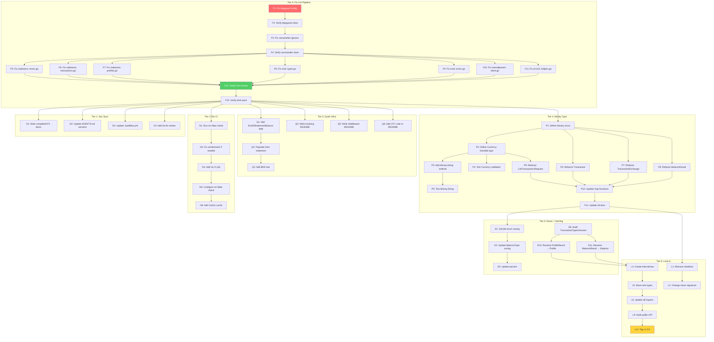

# wise-go — Pareto Execution Plan

> Generated 2026-08-08 02:13 · Pareto-driven · Source: TODO_LIST.md + ROADMAP.md + live codebase audit
>
> **Status: EXECUTED.** All tiers (M1–M15) were completed in the 2026-08-08 session.
> See `docs/status/2026-08-08_02-53_pareto-plan-v040-implementation.md` for the full
> execution record. M16 (v1.0 API lock) is partially done — breaking changes shipped
> but the v1.0 tag is deferred. Success criteria resolved at the bottom of this file.

## Context

This plan takes every item from `TODO_LIST.md` and `ROADMAP.md`, cross-references it
against the **actual** state of the codebase on 2026-08-08, applies Pareto prioritization,
and breaks every item into executable sub-tasks.

### Baseline snapshot (2026-08-08)

| Metric   | Value                                                             | Notes                    |
| -------- | ----------------------------------------------------------------- | ------------------------ |
| Build    | ✅ `go build ./...` passes                                        | Clean                    |
| Tests    | ✅ `go test -race ./...` passes                                   | 1.4s, httptest mocks     |
| Lint     | ❌ 36 issues                                                      | **Broken** — see below   |
| Coverage | ~94.8%                                                            | From prior session badge |
| Files    | 11 `.go` files (9 source + 2 test)                                | Flat package             |
| Deps     | go-branded-id v0.5.1, go-error-family v0.10.0, failsafe-go v0.9.6 | Ahead of docs            |

### Critical discovery: lint pipeline is broken

The prior plan (2026-07-18) claimed "0 lint issues." Today `golangci-lint run` produces
**36 issues**, 14 of which are depguard false positives blocking every legitimate
third-party import:

| Linter      | Count | Root cause                                                                                                  |
| ----------- | ----- | ----------------------------------------------------------------------------------------------------------- |
| depguard    | 14    | Config only allows `$gostd` + `$module`; blocks failsafe-go, go-branded-id, go-error-family, ginkgo, gomega |
| varnamelen  | 15    | Short variable/param names (`id`, `w`, `ed`, `tx`, `b`, `p`, `rc`) not in ignore list                       |
| makezero    | 3     | `make([]T, len(...))` prefers non-zero initial length or explicit `make([]T, 0, len(...))`                  |
| mnd         | 2     | Magic numbers `100` (cents conversion) and `500` (HTTP status threshold)                                    |
| inamedparam | 1     | `Do(*http.Request)` missing named parameter in interface                                                    |
| err113      | 1     | `fmt.Errorf` creating dynamic error in `parseEnum`                                                          |

The depguard config at `.golangci.yml:130-135` is the single root cause. The AGENTS.md
explicitly warns: _"buildflow auto-configure is dangerous — buildflow `--fix` can add 40+
linters that produce false positives."_ The `.golangci.yml` has **107 linters enabled**,
including irrelevant ones like `arangolint`, `clickhouselint`, `promlinter`, `zerologlint`
— this is a buildflow auto-generated config, not a curated list.

### TODO_LIST drift

Three of five P1 items are **already implemented** (commit `4f0604c`) but still marked `[ ]`:

| TODO_LIST item                              | Actual code state                                                |
| ------------------------------------------- | ---------------------------------------------------------------- |
| Type `InvestmentState`                      | ✅ Done — `types.go:196` `type InvestmentState string`           |
| Export `DetailType` constants               | ✅ Done — `transactions.go:138-146` `DetailTypeCardPayment` etc. |
| Accept `Doer` interface in `WithHTTPClient` | ✅ Done — `client.go:21-26` + `options.go:59`                    |

### Version drift

| File           | References                                   | go.mod actual   |
| -------------- | -------------------------------------------- | --------------- |
| AGENTS.md      | go-branded-id v0.3.2, go-error-family v0.7.0 | v0.5.1, v0.10.0 |
| .buildflow.yml | "v0.3.2 + v0.7.0"                            | v0.5.1, v0.10.0 |

---

## Pareto Breakdown

### The 1% that delivers 51% of the result

**Fix the depguard configuration.** One change to `.golangci.yml` — add the three
production deps + two test deps to the allow-list — eliminates 14 of 36 lint errors
instantly and makes the remaining 22 real issues visible. Without this, the lint pipeline
is noise. This is the foundation that makes every subsequent lint-related decision
trustworthy.

### The 4% that delivers 64% of the result

1. **Fix depguard** (the 1% above)
2. **Fix the remaining 22 lint issues** — add common names to varnamelen ignore list,
   fix makezero slice inits, extract or nolint magic numbers, add named param to Do interface
3. **Update TODO_LIST** — mark the 3 completed P1 items as `[x]`, add the depguard/lint fix
4. **Update stale version references** — AGENTS.md and .buildflow.yml to match go.mod

### The 20% that delivers 80% of the result

Items 1-4 above, plus:

5. **Add Nix CI job** — `nix flake check` in `.github/workflows/ci.yml` for reproducible builds
6. **Expose `EndOfStatementBalance`** — Wise returns it, the SDK decodes it, then throws it away. One field addition.
7. **Write P4 documentation** — Mocking guide, middleware guide, UTC assumption in README
8. **Verify `nix flake check`** — end-to-end local validation

### The remaining 20% (to get to 100%)

The **big breaking changes** (P2/P3 from TODO_LIST). These are high-value but high-risk,
requiring design sessions before implementation. They are the long-term type-safety
investments:

- `Money` + `Currency` value objects (collapse paired cents/currency fields)
- Enum casing normalization
- `TransactionTypeUnknown` reconciliation
- Drop `Result` suffix
- Remove `HasMore`
- Move raw wire types to `internal/raw`
- Lock public API at v1.0

---

## Comprehensive Plan — Medium Granularity (30-100min tasks)

Sorted by impact × customer-value ÷ effort. Each task is independently shippable.

> **All M1–M15 done** (executed 2026-08-08, verified green). **M16 partial** (breaking
> changes shipped; v1.0 tag + formal API audit deferred — see TODO_LIST.md P1).

| #   | Task                                                                                      | Impact   | Effort | Value                       | Deps     |
| --- | ----------------------------------------------------------------------------------------- | -------- | ------ | --------------------------- | -------- |
| M1  | Fix depguard config — allow legit third-party deps in `.golangci.yml`                     | Critical | 15min  | Unblocks lint pipeline      | —        |
| M2  | Fix remaining 22 lint issues (varnamelen, makezero, mnd, inamedparam, err113)             | High     | 60min  | Clean lint baseline         | M1       |
| M3  | Update stale docs — TODO_LIST completed items, AGENTS.md + .buildflow.yml versions        | Medium   | 20min  | Trustworthy docs            | —        |
| M4  | Verify `nix flake check` passes locally (test + format derivations)                       | Medium   | 30min  | Confidence in Nix build     | M2       |
| M5  | Add Nix CI job to `.github/workflows/ci.yml` using `cachix/install-nix-action`            | High     | 45min  | Reproducible CI builds      | M4       |
| M6  | Expose `EndOfStatementBalance` on `ListTransactionsResponse`                              | High     | 30min  | Data currently discarded    | —        |
| M7  | Write README sections: Mocking, Middleware, UTC assumption                                | Medium   | 60min  | Consumer onboarding         | —        |
| M8  | Design `Money` value object + `Currency` branded type (types + constructors + tests)      | High     | 90min  | Type-safety foundation      | M2       |
| M9  | Refactor Transaction, Balance, Request, Exchange to use `Money` type                      | High     | 90min  | Impossible-state prevention | M8       |
| M10 | Normalize enum casing — pick one rule, apply to ProfileType, BalanceType, TransactionType | Medium   | 45min  | API consistency             | M2       |
| M11 | Reconcile `TransactionTypeUnknown` — use as real fallback or remove the constant          | Low      | 15min  | API honesty                 | M10      |
| M12 | Drop `Result` suffix from `ProfileResult` / `BalanceResult`                               | Medium   | 45min  | Naming clarity              | M9       |
| M13 | Write v0.4.0 migration guide + CHANGELOG entry for breaking changes                       | Medium   | 30min  | Consumer migration path     | M9-M12   |
| M14 | Remove `ListTransactionsResponse.HasMore` — return `[]Transaction` directly               | Medium   | 30min  | API honesty                 | M9       |
| M15 | Move raw wire types to `internal/raw` package                                             | High     | 90min  | Surface area shrink         | M12, M14 |
| M16 | Lock public API — v1.0 release prep, API audit, godoc review                              | Medium   | 60min  | Stability guarantee         | M15      |

**Total estimated effort: ~13.5 hours**

---

## Detailed Breakdown — Fine Granularity (max 12min tasks)

Every task from the comprehensive plan, decomposed into atomic actions. Sorted by
execution order within each tier.

### Tier 0: Fix lint pipeline (M1 + M2)

| #   | Sub-task                                                                                                            | Parent | Est  | Deps   |
| --- | ------------------------------------------------------------------------------------------------------------------- | ------ | ---- | ------ |
| F1  | Add `github.com/failsafe-go`, `github.com/larsartmann`, `github.com/onsi` to depguard allow-list in `.golangci.yml` | M1     | 5min | —      |
| F2  | Run `golangci-lint run` — verify depguard errors are gone                                                           | M1     | 2min | F1     |
| F3  | Add `w`, `ed`, `tx`, `b`, `p`, `rc`, `id` to varnamelen ignore-names in `.golangci.yml`                             | M2     | 5min | F2     |
| F4  | Run `golangci-lint run` — verify varnamelen errors are gone                                                         | M2     | 2min | F3     |
| F5  | Fix makezero: change `make([]string, len(...))` to `make([]string, 0, len(...))` in `errors.go:117`                 | M2     | 5min | F4     |
| F6  | Fix makezero: change `make([]Transaction, len(...))` in `transactions.go:47` or add nolint                          | M2     | 5min | F4     |
| F7  | Fix makezero: change `make([]ProfileResult, len(...))` in `profiles.go:19` or add nolint                            | M2     | 5min | F4     |
| F8  | Fix mnd: extract `centsPerUnit = 100` constant in `types.go` BalanceAmount.Cents()                                  | M2     | 5min | F4     |
| F9  | Fix mnd: add `//nolint:mnd` or extract `httpStatusServerErrorThreshold = 500` in `errors.go:141`                    | M2     | 3min | F4     |
| F10 | Fix inamedparam: add named param `Do(req *http.Request)` to `Doer` interface in `client.go:25`                      | M2     | 3min | F4     |
| F11 | Fix err113: add `//nolint:err113` to `parseEnum` in `helpers.go:24` (generic enum parser)                           | M2     | 3min | F4     |
| F12 | Run `golangci-lint run` — verify 0 issues                                                                           | M2     | 2min | F5-F11 |
| F13 | Run `go test ./...` — verify nothing broke                                                                          | M2     | 2min | F5-F11 |

### Tier 1: Documentation sync (M3)

| #  | Sub-task                                                                     | Parent | Est  | Deps |
| -- | ---------------------------------------------------------------------------- | ------ | ---- | ---- |
| D1 | Mark P1 items 1-3 as `[x]` in TODO_LIST.md                                   | M3     | 5min | —    |
| D2 | Update AGENTS.md dep versions: go-branded-id v0.5.1, go-error-family v0.10.0 | M3     | 5min | —    |
| D3 | Update .buildflow.yml comment to reference v0.5.1 + v0.10.0                  | M3     | 3min | —    |
| D4 | Add new TODO_LIST entry: "Fix depguard config" under Done section            | M3     | 3min | F12  |
| D5 | Add new TODO_LIST entry: "Fix remaining lint issues" under Done section      | M3     | 3min | F12  |

### Tier 2: Nix CI (M4 + M5)

| #  | Sub-task                                                                           | Parent | Est   | Deps |
| -- | ---------------------------------------------------------------------------------- | ------ | ----- | ---- |
| N1 | Run `nix flake check` locally — observe pass/fail                                  | M4     | 10min | —    |
| N2 | If fails: fix vendorHash in flake.nix (`nix build .#test` to get correct hash)     | M4     | 10min | N1   |
| N3 | Verify `nix fmt` produces no diff (formatting check)                               | M4     | 5min  | N1   |
| N4 | Add `nix:` job to `.github/workflows/ci.yml` using `cachix/install-nix-action@v27` | M5     | 10min | N1   |
| N5 | Configure Nix job to run `nix flake check` (format + test derivations)             | M5     | 5min  | N4   |
| N6 | Add Cachix cache step for Go module fetch performance                              | M5     | 10min | N4   |
| N7 | Add `paths-ignore` consistency — ensure Nix job also ignores docs-only changes     | M5     | 5min  | N4   |
| N8 | Verify CI YAML is valid (`nix fmt .` or `yamllint`)                                | M5     | 5min  | N5   |

### Tier 3: Quick wins (M6 + M7)

| #  | Sub-task                                                                                             | Parent | Est   | Deps |
| -- | ---------------------------------------------------------------------------------------------------- | ------ | ----- | ---- |
| Q1 | Add `EndOfStatementBalance` field to `ListTransactionsResponse` in `types.go`                        | M6     | 5min  | —    |
| Q2 | Populate `EndOfStatementBalance` from `statement.EndOfStatementBalance.Cents()` in `transactions.go` | M6     | 5min  | Q1   |
| Q3 | Add test: verify EndOfStatementBalance is surfaced in ListTransactions BDD test                      | M6     | 10min | Q2   |
| Q4 | Write "Mocking the client" README section — narrow consumer-side interfaces pattern                  | M7     | 12min | —    |
| Q5 | Write "Request middleware via WithHTTPClient" README section — Transport wrapping                    | M7     | 12min | —    |
| Q6 | Add UTC timezone note to README transactions section (mirror field comment)                          | M7     | 5min  | —    |

### Tier 4: Money type design + implementation (M8 + M9)

| #   | Sub-task                                                                                                                        | Parent | Est   | Deps    |
| --- | ------------------------------------------------------------------------------------------------------------------------------- | ------ | ----- | ------- |
| P1  | Define `Money` struct: `Cents int64` + `Currency Currency` in `types.go`                                                        | M8     | 5min  | M2      |
| P2  | Define `Currency` branded type: `type Currency string` + `NewCurrency(s string) (Currency, error)` with ISO 4217 validation     | M8     | 10min | P1      |
| P3  | Add `Money.String()` method for display (e.g., "EUR 12.34")                                                                     | M8     | 10min | P1      |
| P4  | Write unit tests for `Currency` validation (valid, invalid, edge cases)                                                         | M8     | 10min | P2      |
| P5  | Write unit tests for `Money.String()` formatting                                                                                | M8     | 5min  | P3      |
| P6  | Refactor `Transaction` struct: replace paired AmountCents/AmountCurrency with `Amount Money`, etc.                              | M9     | 12min | P1      |
| P7  | Refactor `TransactionExchange` struct: FromCents/FromCurrency → `From Money`, ToCents/ToCurrency → `To Money`                   | M9     | 10min | P1      |
| P8  | Refactor `BalanceResult` struct: AmountCents/AmountCurrency → `Amount Money`, ReservedCents/ReservedCurrency → `Reserved Money` | M9     | 10min | P1      |
| P9  | Refactor `ListTransactionsRequest`: keep `Currency` as new branded type                                                         | M9     | 5min  | P2      |
| P10 | Update all map functions (mapTransaction, mapBalance, mapExchange) to construct Money                                           | M9     | 12min | P6-P8   |
| P11 | Update all tests to use new Money type fields                                                                                   | M9     | 12min | P6-P10  |
| P12 | Run `go test ./...` — verify all tests pass with new types                                                                      | M9     | 5min  | P10-P11 |
| P13 | Run `golangci-lint run` — verify 0 issues with new types                                                                        | M9     | 5min  | P12     |

### Tier 5: Enum + naming cleanup (M10 + M11 + M12)

| #   | Sub-task                                                                        | Parent | Est   | Deps    |
| --- | ------------------------------------------------------------------------------- | ------ | ----- | ------- |
| E1  | Decide enum casing rule (recommend: lowercase for SDK-facing enums)             | M10    | 5min  | —       |
| E2  | Update ProfileType: already lowercase ✅ (no change needed)                     | M10    | 2min  | E1      |
| E3  | Update BalanceType: change STANDARD→standard, SAVINGS→savings                   | M10    | 5min  | E1      |
| E4  | Update InvestmentState: decide if consumer-facing or internal-only              | M10    | 5min  | E1      |
| E5  | Update parseBalanceType/parseProfileType to handle new casing                   | M10    | 5min  | E3      |
| E6  | Update all tests for new enum values                                            | M10    | 10min | E3-E5   |
| E7  | Run `go test ./...` — verify enum changes pass                                  | M10    | 5min  | E6      |
| E8  | Audit `classifyTransactionType` — does it ever return `TransactionTypeUnknown`? | M11    | 5min  | —       |
| E9  | Decision: if never returned, remove `TransactionTypeUnknown` constant           | M11    | 5min  | E8      |
| E10 | Rename `ProfileResult` → `Profile`, old `Profile` → move to `internal/raw` prep | M12    | 10min | M9      |
| E11 | Rename `BalanceResult` → `Balance`, old `Balance` → move to `internal/raw` prep | M12    | 10min | M9      |
| E12 | Update all tests and README for new names                                       | M12    | 12min | E10-E11 |
| E13 | Run `go test ./...` + `golangci-lint run` — verify naming changes               | M12    | 5min  | E12     |

### Tier 6: Lock-in release (M14 + M15 + M16)

| #   | Sub-task                                                                                                                                                                           | Parent | Est   | Deps   |
| --- | ---------------------------------------------------------------------------------------------------------------------------------------------------------------------------------- | ------ | ----- | ------ |
| L1  | Remove `HasMore` field from `ListTransactionsResponse`                                                                                                                             | M14    | 5min  | M9     |
| L2  | Change `ListTransactions` return type from `*ListTransactionsResponse` to `([]Transaction, EndOfStatementBalance, error)` or `(*ListTransactionsResult, error)`                    | M14    | 10min | L1     |
| L3  | Update all tests for new return signature                                                                                                                                          | M14    | 10min | L2     |
| L4  | Create `internal/raw/` package                                                                                                                                                     | M15    | 5min  | M12    |
| L5  | Move `Profile`, `Balance`, `BalanceAmount`, `StatementResponse`, `StatementTransaction`, `TransactionDetails`, `ExchangeDetails`, `ErrorResponse`, `ErrorDetail` to `internal/raw` | M15    | 12min | L4     |
| L6  | Update imports in all source files (client, profiles, balances, transactions, errors, helpers)                                                                                     | M15    | 12min | L5     |
| L7  | Verify `go build ./...` passes with new package layout                                                                                                                             | M15    | 5min  | L6     |
| L8  | Run `go test ./...` — verify all tests pass                                                                                                                                        | M15    | 5min  | L7     |
| L9  | Audit all exported symbols — verify each is intentional public API                                                                                                                 | M16    | 12min | M15    |
| L10 | Review godoc comments on all exported types and methods                                                                                                                            | M16    | 12min | L9     |
| L11 | Update README to reflect final v1.0 API surface                                                                                                                                    | M16    | 10min | L9     |
| L12 | Tag v1.0.0 release                                                                                                                                                                 | M16    | 5min  | L9-L11 |

### Tier 7: Release documentation (M13)

| #  | Sub-task                                                                                    | Parent | Est   | Deps    |
| -- | ------------------------------------------------------------------------------------------- | ------ | ----- | ------- |
| R1 | Write CHANGELOG.md entry for v0.4.0 (Money type, enum normalization, EndOfStatementBalance) | M13    | 10min | M9-M12  |
| R2 | Write migration guide: old field names → new field names mapping table                      | M13    | 10min | M9      |
| R3 | Write CHANGELOG.md entry for v1.0.0 (HasMore removal, internal/raw, API lock)               | M13    | 5min  | M14-M15 |
| R4 | Update FEATURES.md with all newly shipped features                                          | M13    | 10min | M9-M15  |
| R5 | Update ROADMAP.md — mark completed axes, update timeline                                    | M13    | 10min | M9-M15  |

---

## Execution Graph

---

## What to execute first

### Immediate (this session): Tier 0 + Tier 1

Tasks F1-F13 + D1-D5. This restores the lint pipeline to green, updates stale docs,
and marks completed work. **~2 hours.** This is the 64% that comes from 4% of the work.

### Next sprint: Tier 2 + Tier 3

Nix CI + quick wins (EndOfStatementBalance, README docs). **~3 hours.** Ships the
remaining P1 items and unlocks P4 documentation.

### v0.4.0 release: Tier 4 + Tier 5

Money/Currency types, enum normalization, naming cleanup. **~6 hours.** The coordinated
breaking change release.

### v1.0.0 release: Tier 6 + Tier 7

HasMore removal, internal/raw relocation, API lock. **~4 hours.** The lock-in release.

---

## Risk Assessment

| Risk                                                 | Likelihood | Impact | Mitigation                                        |
| ---------------------------------------------------- | ---------- | ------ | ------------------------------------------------- |
| Depguard fix exposes new lint errors not seen before | Medium     | Low    | Tier 0 handles this explicitly (F3-F11)           |
| Money type refactor breaks consumer code             | High       | Medium | Ship in v0.4.0 with migration guide (R2)          |
| `internal/raw` move breaks test imports              | Medium     | Low    | Tests use result types, not raw types (by design) |
| Nix CI job is slow (module fetch)                    | High       | Low    | Cachix cache step (N6)                            |
| Enum casing change breaks `errors.As` type switches  | Low        | Medium | Enums are value types, not error types            |

---

## Success Criteria

- [x] `golangci-lint run` exits 0
- [x] `go test -race ./...` passes
- [x] `nix flake check` passes
- [x] CI has a green Nix job
- [x] TODO_LIST reflects reality (no stale `[ ]` items) — rebuilt 2026-08-08 docs-health pass
- [x] AGENTS.md versions match go.mod
- [x] `EndOfStatementBalance` is accessible to consumers
- [x] README has mocking + middleware + UTC sections
- [x] Money/Currency types make mismatched currency/amount unrepresentable
- [ ] v1.0 API is locked and documented — deferred (TODO_LIST.md P1)
