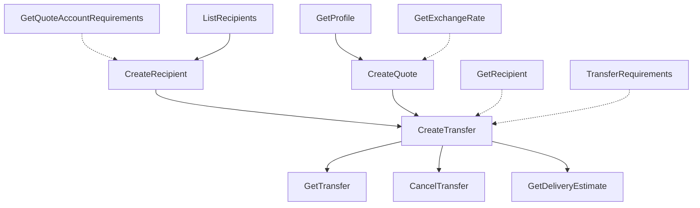

# Wise API Full Implementation Plan

**Date:** 2026-08-19
**Source:** [docs.wise.com/api-reference](https://docs.wise.com/api-reference)
**Current SDK version:** v0.7.0

---

## Executive Summary

The Wise Platform API exposes ~135 endpoints across 29 categories. wise-go v0.7.0 currently implements **5 client methods** covering the read side of 4 resources:

- `ListProfiles` (`GET /v2/profiles`)
- `ListBalances` (`GET /v4/profiles/{id}/balances`)
- `GetBalance` (client-side scan over `ListBalances`)
- `ListTransactions` (`GET /v1/profiles/{id}/balance-statements/{id}/statement.json`)
- `ListTransfers` (`GET /v1/transfers`)

This plan maps the full API surface, applies Pareto prioritisation, and defines an executable dependency graph. The goal is not to land every endpoint in one change — that would be unmaintainable — but to establish the patterns (write helpers, request types, raw/result boundaries, tests) and ship the **1% that unlocks 51% of consumer value**: the core transfer flow.

---

## Pareto Prioritisation

| Tier                 | Share of endpoints | Approx. count | Value delivered  | Target endpoints                                                                                                          |
| -------------------- | ------------------ | ------------- | ---------------- | ------------------------------------------------------------------------------------------------------------------------- |
| **1% core**          | ~1–2%              | 3–4           | 51%              | `GetProfile`, `GetTransfer`, `CreateQuote`, `GetQuote`, `CreateRecipient`, `GetRecipient`, `CreateTransfer`               |
| **4% high-value**    | ~4%                | 5–6           | 64% (cumulative) | `ListRecipients`, `GetExchangeRate`, `CancelTransfer`, `GetDeliveryEstimate`, `GetQuoteAccountRequirements`               |
| **20% SDK-complete** | ~20%               | 27            | 80% (cumulative) | Quotes (full), Recipients (full), Transfers (full), Balances expanded, Statements CSV/PDF, Webhooks signature, Users read |
| **80% long tail**    | ~80%               | 100+          | 20%              | Cards, KYC, SCA factors, Disputes, Digital Wallets, Batch Groups, Simulations, Cases                                      |

**Principle:** ship the 1% first, because a consumer who can create a quote, add a recipient, and send a transfer gets the majority of the SDK's value. Everything else is incremental.

---

## Full Endpoint Inventory

### Tier 1 — Core transfer flow (ship first)

| #  | Category       | Method | Path                                        | SDK method                                            | Status  |
| -- | -------------- | ------ | ------------------------------------------- | ----------------------------------------------------- | ------- |
| 1  | Profiles       | GET    | `/v2/profiles/{profileId}`                  | `GetProfile(ctx, ProfileID)`                          | PLANNED |
| 2  | Quotes         | POST   | `/v3/quotes`                                | `CreateUnauthenticatedQuote(ctx, CreateQuoteRequest)` | PLANNED |
| 3  | Quotes         | POST   | `/v3/profiles/{profileId}/quotes`           | `CreateQuote(ctx, ProfileID, CreateQuoteRequest)`     | PLANNED |
| 4  | Quotes         | GET    | `/v3/profiles/{profileId}/quotes/{quoteId}` | `GetQuote(ctx, ProfileID, QuoteID)`                   | PLANNED |
| 5  | Quotes         | GET    | `/v1/quotes/{quoteId}/account-requirements` | `GetQuoteAccountRequirements(ctx, QuoteID)`           | PLANNED |
| 6  | Recipients     | GET    | `/v2/accounts`                              | `ListRecipients(ctx, ListRecipientsRequest)`          | PLANNED |
| 7  | Recipients     | GET    | `/v1/accounts/{accountId}`                  | `GetRecipient(ctx, RecipientID)`                      | PLANNED |
| 8  | Recipients     | POST   | `/v1/accounts`                              | `CreateRecipient(ctx, CreateRecipientRequest)`        | PLANNED |
| 9  | Transfers      | GET    | `/v1/transfers/{transferId}`                | `GetTransfer(ctx, TransferID)`                        | PLANNED |
| 10 | Transfers      | POST   | `/v1/transfers`                             | `CreateTransfer(ctx, CreateTransferRequest)`          | PLANNED |
| 11 | Transfers      | PUT    | `/v1/transfers/{transferId}/cancel`         | `CancelTransfer(ctx, TransferID)`                     | PLANNED |
| 12 | Transfers      | GET    | `/v1/delivery-estimates/{transferId}`       | `GetDeliveryEstimate(ctx, TransferID)`                | PLANNED |
| 13 | Exchange rates | GET    | `/v1/rates`                                 | `GetExchangeRate(ctx, source, target, time)`          | PLANNED |

### Tier 2 — High-value, self-contained

| #  | Category              | Method | Path                                                                                             | Notes                                                         |
| -- | --------------------- | ------ | ------------------------------------------------------------------------------------------------ | ------------------------------------------------------------- |
| 14 | Users                 | GET    | `/me`                                                                                            | Current user                                                  |
| 15 | Users                 | GET    | `/users/{userId}`                                                                                | User by ID                                                    |
| 16 | Balances              | POST   | `/v4/profiles/{profileId}/balances`                                                              | Create balance                                                |
| 17 | Balances              | GET    | `/v4/profiles/{profileId}/balances/{balanceId}`                                                  | Get balance by ID (new endpoint; may remove client-side scan) |
| 18 | Balances              | GET    | `/v1/profiles/{profileId}/total-funds/{currency}`                                                | Total funds                                                   |
| 19 | Statements            | GET    | `/v1/profiles/{profileId}/balance-statements/{balanceId}/statement.{csv,pdf,xlsx,xml,mt940,qif}` | Format parameter                                              |
| 20 | Webhooks              | —      | Signature verification helper                                                                    | High value, no REST calls                                     |
| 21 | Transfer requirements | POST   | `/v1/transfer-requirements`                                                                      | Validate before create                                        |
| 22 | Currencies            | GET    | `/v1/currencies`                                                                                 | Allowed currencies                                            |
| 23 | Comparisons           | GET    | `/v1/comparisons`                                                                                | Provider comparison                                           |

### Tier 3 — Moderate value, broader surface

| #  | Category               | Method         | Path                                                                                        | Notes                   |
| -- | ---------------------- | -------------- | ------------------------------------------------------------------------------------------- | ----------------------- |
| 24 | Profiles               | GET            | `/profiles/{profileId}`                                                                     | v1 alias                |
| 25 | Profiles               | POST           | `/profiles/personal-profile`                                                                | Create personal profile |
| 26 | Profiles               | POST           | `/profiles/business-profile`                                                                | Create business profile |
| 27 | Profiles               | PUT            | `/profiles/{profileId}/personal-profile`                                                    | Update personal profile |
| 28 | Profiles               | PUT            | `/profiles/{profileId}/business-profile`                                                    | Update business profile |
| 29 | Addresses              | GET/POST       | `/addresses`, `/addresses/{id}`, `/address-requirements`                                    | Address book            |
| 30 | Bank account details   | GET/POST       | `/profiles/{profileId}/account-details`, `/profiles/{profileId}/bank-details`               | IBAN/routing            |
| 31 | Multi-currency account | GET            | `/v4/profiles/{profileId}/multi-currency-account`, `/borderless-accounts-configuration/...` | MCA                     |
| 32 | Batch groups           | POST/PATCH/GET | `/profiles/{profileId}/batch-groups/...`                                                    | Bulk payments           |
| 33 | Payin deposit details  | GET            | `/profiles/{profileId}/transfers/{transferId}/deposit-details/bank-transfer`                | Pay-in instructions     |
| 34 | Direct debit accounts  | GET/POST       | `/profiles/{profileId}/direct-debit-accounts`                                               | Bulk funding            |
| 35 | Bulk settlement        | POST           | `/settlements`                                                                              | Client-creds only       |

### Tier 4 — Specialised / partner-only / long tail

| #  | Category                             | Count | Notes                                                                          |
| -- | ------------------------------------ | ----- | ------------------------------------------------------------------------------ |
| 36 | OAuth token                          | 1     | `POST /oauth/token` — only if SDK takes over token exchange                    |
| 37 | JOSE playground                      | 6     | Signature/encryption testing                                                   |
| 38 | Users write                          | 4     | Signup, exists, contact email                                                  |
| 39 | Claim account                        | 1     | `POST /user/claim-account`                                                     |
| 40 | Profile verification                 | 8     | KYC review, additional verification, FaceTec                                   |
| 41 | Link requests / embedded flows       | 4     | iframe/webview helpers                                                         |
| 42 | SCA / one-time tokens                | 10    | OTT status, SCA sessions, OTP channels                                         |
| 43 | PIN / facemaps / device fingerprints | 8     | JWE-encrypted SCA factors                                                      |
| 44 | Cards                                | ~25   | Orders, transactions, limits, spend controls, disputes, sensitive details, 3DS |
| 45 | Digital wallets                      | 4     | Apple/Google Pay push provisioning                                             |
| 46 | Disputes                             | 7     | Card dispute management                                                        |
| 47 | Incoming transfers                   | 1     | Partner-only                                                                   |
| 48 | Payins                               | 1     | PayNow QR                                                                      |
| 49 | Webhook subscriptions                | 8     | Application + profile level                                                    |
| 50 | Cases                                | 3     | Partner support                                                                |
| 51 | Sandbox simulations                  | ~15   | Testing-only helpers                                                           |

---

## Dependency Graph

The core flow has strict prerequisites:

**Execution order for the 1% tier:**

1. HTTP write helpers (`post`, `postWithQuery`, `patch`, `put`, `delete`) in `client.go`.
2. `GetProfile` — validates the `{id}` path pattern.
3. `GetExchangeRate` — no dependencies; confirms query-param helpers.
4. `GetTransfer` — reuses `mapTransfer` from `ListTransfers`.
5. `CreateQuote` + `GetQuote` — introduces `QuoteID`, `Quote` type, `PayIn`/`PayOut` enums.
6. `CreateRecipient` + `GetRecipient` + `ListRecipients` — introduces `Recipient` type and account-details polymorphism.
7. `CreateTransfer` — consumes `QuoteID` + `RecipientID`.
8. `CancelTransfer` + `GetDeliveryEstimate` — cheap follow-ups.

---

## Architectural Decisions

1. **Keep the flat `client.X` surface for now.** The resource count (~7 after this phase) is still below the ~8 threshold documented in `ROADMAP.md` for a service-client refactor.
2. **Extend the two-layer raw/result boundary.** Every new response type gets a wire-format struct in `internal/raw/types.go` and a parsed public type in `types.go`.
3. **Branded IDs for every new entity.** Add `QuoteID`, `UserID`, `AddressID`, `CardToken`, etc., as needed. The 1% tier needs `QuoteID`.
4. **Write helpers mirror read helpers.** `post(ctx, path, body, target)` encodes `body` as JSON, sets `Content-Type: application/json`, and delegates response handling to `checkError` + `jsonDecode`.
5. **Idempotency headers where documented.** `X-idempotence-uuid` for `CreateRecipient`, `CreateTransfer`, and business-profile creation. Accept an optional `IdempotenceKey` field in request structs.
6. **Validation before the network.** Reject impossible requests (e.g. `CreateTransfer` without `QuoteID` or `TargetAccountID`) with `errorfamily.NewRejection`, matching the existing `ListTransactionsRequest.validate()` pattern.
7. **No `Money` arithmetic.** `Money` remains a serialization boundary value object. Quote/transfer amounts are parsed into `Money`; consumers perform their own math.

---

## Quality Gates Per Endpoint

For every endpoint added:

- [ ] Raw wire type in `internal/raw/types.go`.
- [ ] Parsed public type in `types.go`.
- [ ] Branded ID if a new entity is referenced.
- [ ] Client method in the appropriate resource file.
- [ ] Request validation (if any fields constrain each other).
- [ ] BDD test in `wise_test.go` with `httptest` mock.
- [ ] Unit test for mapper edge cases in `internal_test.go`.
- [ ] Update `FEATURES.md`, `TODO_LIST.md`, `CHANGELOG.md`.

---

## Recommended Phasing

### Phase 1 — Foundations (this session)

- HTTP POST/PATCH/PUT/DELETE helpers.
- `GetProfile`.
- `GetExchangeRate`.
- `GetTransfer`.

### Phase 2 — Quotes + Recipients (next session)

- `CreateQuote`, `GetQuote`, `GetQuoteAccountRequirements`.
- `ListRecipients`, `GetRecipient`, `CreateRecipient`.

### Phase 3 — Transfers (next session)

- `CreateTransfer`.
- `CancelTransfer`, `GetDeliveryEstimate`.

### Phase 4 — Completion (future)

- Tier 2 endpoints, then tier 3, then tier 4 as consumer demand justifies.

---

## Out of Scope

The following are documented but deliberately excluded from the initial implementation because they require non-REST patterns, partner access, or are too specialised:

- Open Banking API (separate regulated API).
- JOSE/JWE encryption playground.
- FaceTec biometric verification.
- PCI-sensitive card details.
- Partner support cases.
- Sandbox simulation endpoints (testing-only).
