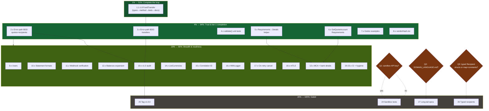

# wise-go Pareto Execution Plan — v0.8.1 → v1.0

**Date:** 2026-08-21 12:05 CEST
**Inputs:** `TODO_LIST.md` (19 open items, rebuilt 2026-08-21), `ROADMAP.md` (4 axes), `docs/status/2026-08-21_09-50_docs-health-audit-and-readme-overhaul.md` (f-list), `docs/status/2026-08-19_18-15_core-transfer-flow-completion.md` (f-list), `docs/planning/2026-08-19_wise-api-full-implementation-plan.md` (tier model).
**Baseline:** v0.8.1 — 18 endpoint methods / 9 resources, core transfer flow complete except `FundTransfer`; 84.2% coverage; all mock-tested; docs freshly audited (2026-08-21).

**Customer:** the Go developer moving money and syncing financial data through Wise (consumer #1: Lars's bank-sync project). Value = capability × trust × breadth, in that order.

---

## Pareto Breakdown

### The 1% that delivers 51% — COMPLETE THE MONEY-MOVEMENT LOOP

**`FundTransfer`** (`POST /v1/profiles/{id}/transfers/{id}/payments`).

The SDK can quote, recipient, create, track, cancel — but not FUND. Every consumer's flow dead-ends at "now pay for it" with raw HTTP. One endpoint closes the loop and upgrades the SDK from "transfer scaffolding" to "moves money end-to-end". Nothing else on the backlog changes the product category; this does.

### The 4% that delivers 64% (cumulative) — MAKE THE LOOP TRUSTWORTHY

Hardening exactly what the 1% delivered:

1. **Error-path BDD tests** for all five write endpoints (400/404/409/SCA-403/429-with-Retry-After). Today only happy paths are covered — unacceptable for money.
2. **Validation edge-case unit tests** for the three `validate()` funcs (`transfers.go:133`, `transfer_requirements.go:42`, `quotes.go:88`).
3. **Requirements→Details wiring** — `ValidateTransferRequirements` output is currently discovery-only; map discovered required fields onto `CreateTransferRequest.Details`.
4. **`GetQuoteAccountRequirements`** — the last tier-1 row; bridges quotes→recipients for the corridor problem.
5. **Godoc examples** for the four new APIs + `vendorHash.nix` cleanup.

### The 20% that delivers 80% (cumulative) — BREADTH + OBSERVABILITY + RELEASE READINESS

Tier-2 reads (`GetMe`/`GetUser`, `GetStatement` formats, webhook signature verification, balances expansion, MCA/bank details, `ListCurrencies`), observability (`WithLogger`, per-request correlation ID, context-aware retry cancellation, mTLS docs), v1.0 audit prep, and CI quality automation (coverage badge, link checker, govulncheck, Cachix).

### The other 20% → 100% — GATED WORK

Blocked on user input or demand (do NOT fake-schedule):

- **Sandbox integration tests** — blocked on a sandbox API key (the single highest-trust item, but unexecutable without credentials).
- **v1.0.0 tag** — blocked on API audit + explicit approval (irreversible).
- **Typed recipient-detail structs** — blocked on the typed-vs-map decision (carried unanswered through THREE reports now).
- **Long-tail epics** — WithMetrics, `Page[T]`, property-based tests, service-client refactor, tier-3/4 APIs (batch groups, direct debit, cards, KYC, disputes). Demand-gated; decompose when unlocked, not before.

---

## Table A — Comprehensive Plan (27 tasks, 30–100 min each)

Sorted: Pareto tier → impact → effort. **Effort** in minutes. **Value** = customer value grade. `Gate` = the project's per-endpoint quality gates (raw type, public type, branded ID, client method, validation, BDD test, mapper unit test, FEATURES/TODO/CHANGELOG rows, flake fileset).

| #  | Task                                                                                                                     | Tier   | Impact   | Effort | Value                                     | Depends on           | Gates             |
| -- | ------------------------------------------------------------------------------------------------------------------------ | ------ | -------- | ------ | ----------------------------------------- | -------------------- | ----------------- |
| 1  | `FundTransfer` endpoint: raw + public types, client method, validation, BDD, mapper tests, README funding step           | **1%** | Critical | 90     | Completes E2E money movement              | —                    | full              |
| 2  | Error-path BDD tests: quotes + recipients write endpoints (400/404/SCA/429)                                              | 4%     | Critical | 60     | Failure-mode trust for money writes       | —                    | tests only        |
| 3  | Error-path BDD tests: transfers write endpoints (create/cancel/requirements + GetTransfer errors)                        | 4%     | Critical | 60     | Failure-mode trust for money writes       | —                    | tests only        |
| 4  | Validation edge-case unit tests: 3× `validate()` (missing fields, amount/currency matrix)                                | 4%     | High     | 60     | Compile-time guarantees proven at runtime | —                    | tests only        |
| 5  | Requirements→Details helper: pure mapping func + two-pass refresh tests + example                                        | 4%     | High     | 90     | Closes the discovery dead-end             | —                    | func+tests+docs   |
| 6  | `GetQuoteAccountRequirements` endpoint (last tier-1 row)                                                                 | 4%     | High     | 60     | Corridor discovery without recipients     | —                    | full              |
| 7  | Godoc examples: `CancelTransfer`, `GetDeliveryEstimate`, `ValidateTransferRequirements`, `CreateQuote`                   | 4%     | Medium   | 45     | `go doc` shows usage                      | —                    | examples          |
| 8  | Extract `vendorHash` to `vendorHash.nix` + verify flake fileset current                                                  | 4%     | Low      | 30     | Cleaner dep-bump diffs                    | —                    | nix check         |
| 9  | `GetMe` / `GetUser` endpoints                                                                                            | 20%    | Medium   | 60     | Identity read for onboarding flows        | —                    | full              |
| 10 | `GetStatement` with format param (CSV/PDF/XLSX)                                                                          | 20%    | High     | 90     | Statement export beyond JSON              | —                    | full              |
| 11 | Webhook signature verification helper + README section                                                                   | 20%    | High     | 90     | Safe webhook consumption                  | —                    | full              |
| 12 | Balances expansion: `CreateBalance` + direct `GetBalance` + `GetTotalFunds`                                              | 20%    | Medium   | 90     | Balance lifecycle + faster lookup         | —                    | full ×3           |
| 13 | MCA/account details: `GetBankAccountDetails` + `GetMultiCurrencyAccount`                                                 | 20%    | Medium   | 75     | "Where do I receive money" flows          | —                    | full ×2           |
| 14 | `ListCurrencies` endpoint                                                                                                | 20%    | Low      | 30     | Dropdown/UI population                    | —                    | full              |
| 15 | Per-request correlation ID override (context key; fix dangling `options.go:72` doc ref)                                  | 20%    | Medium   | 45     | Request-level tracing                     | —                    | func+tests        |
| 16 | `WithLogger` request/response logging hook                                                                               | 20%    | Medium   | 60     | Operability without transport hacks       | —                    | func+tests+README |
| 17 | Context-aware retry cancellation (failsafe-go ctx threading)                                                             | 20%    | High     | 60     | Abort in-flight retries                   | —                    | func+tests        |
| 18 | mTLS documentation / `WithMTLS` pattern                                                                                  | 20%    | Medium   | 30     | Compliance-heavy consumers                | —                    | docs              |
| 19 | v1.0 API audit: exported-symbol inventory + godoc review + findings report                                               | 20%    | High     | 60     | Prerequisite for the API lock             | 1–18 ideally shipped | report            |
| 20 | Coverage badge automation (CI generates, no hand-edited numbers)                                                         | 20%    | Medium   | 45     | Kills badge drift (94.8%→84.2% incident)  | —                    | CI                |
| 21 | Markdown link checker in `nix flake check` (lychee)                                                                      | 20%    | Low      | 30     | Catches ghost references                  | —                    | nix               |
| 22 | `govulncheck` triage + Cachix binary cache for CI                                                                        | 20%    | Medium   | 45     | Security posture + 15min→<5min CI         | —                    | CI                |
| 23 | Housekeeping: resolve 68-vs-77 spec count, AGENTS `wise-api-core-schemas.json` note, coverage-measurement note           | 20%    | Low      | 30     | Doc hygiene                               | —                    | docs              |
| 24 | Sandbox integration-test workflow                                                                                        | Rest   | Critical | 90     | **BLOCKED: needs sandbox API key**        | user key             | —                 |
| 25 | Tag `v1.0.0` + release notes                                                                                             | Rest   | High     | 30     | **BLOCKED: audit (#19) + your approval**  | 19                   | —                 |
| 26 | Typed recipient details (structs vs map + constants)                                                                     | Rest   | High     | 90     | **BLOCKED: decision (question #3)**       | user decision        | —                 |
| 27 | Long-tail epic register: WithMetrics, `Page[T]`, property tests, Quote residuals, service-client refactor, tier-3/4 APIs | Rest   | Low–Med  | —      | Demand-gated; decompose on unlock         | demand               | —                 |

**Executable subtotal (1–23): ~21.5 h focused work.** Tasks 1–8 (1%+4%): ~7.5 h.

---

## Table B — Fine-Grained Plan (80 tasks, ≤12 min each)

Sorted within tier by execution order (dependencies flow top-down). Blocked work (Table A #24–27) is deliberately NOT fake-decomposed — slicing speculation into 12-minute rows is Verschlimmbesserung; each unlocks via its gate above.

### Tier 1% — the loop (8 tasks)

| ID  | Task                                                                                          | ≤min | Impact   |
| --- | --------------------------------------------------------------------------------------------- | ---- | -------- |
| 1.1 | `raw` wire type for fund-transfers response in `internal/raw/types.go`                        | 10   | Critical |
| 1.2 | Public `FundTransferResult` type + mapper ( Corruption-classified parse errors) in `types.go` | 10   | Critical |
| 1.3 | `Client.FundTransfer(ctx, ProfileID, TransferID)` + zero-ID Rejection validation              | 12   | Critical |
| 1.4 | Add source file(s) to `flake.nix` fileset unions                                              | 3    | Critical |
| 1.5 | BDD happy path: assert POST method, path, empty body, mapped result                           | 12   | Critical |
| 1.6 | BDD rejections: zero profile ID, zero transfer ID → no network call                           | 8    | High     |
| 1.7 | Mapper corruption unit test (bad timestamp / bad currency)                                    | 8    | High     |
| 1.8 | README funding step in core-flow example + CHANGELOG/FEATURES/TODO rows                       | 10   | High     |

### Tier 4% — trust & tier-1 completion (26 tasks)

| ID  | Task                                                                        | ≤min | Impact   |
| --- | --------------------------------------------------------------------------- | ---- | -------- |
| 2.1 | `CreateQuote` 400 validation-response BDD test                              | 10   | Critical |
| 2.2 | `CreateQuote` 401 / 403-SCA / 404 BDD tests                                 | 12   | Critical |
| 2.3 | `CreateQuote` 429 with `Retry-After` + `X-Rate-Limited-By` assertions       | 10   | Critical |
| 2.4 | `CreateRecipient` 400 / 404 / SCA-403 BDD tests                             | 12   | Critical |
| 2.5 | `ListRecipients` error-path BDD test                                        | 10   | High     |
| 3.1 | `CreateTransfer` 400 + 409 duplicate-transaction BDD tests                  | 12   | Critical |
| 3.2 | `CreateTransfer` 404 / SCA-403 / 429 BDD tests                              | 12   | Critical |
| 3.3 | `CancelTransfer` 409 not-allowed + 404 BDD tests                            | 12   | Critical |
| 3.4 | `ValidateTransferRequirements` 400 / SCA-403 BDD tests                      | 10   | High     |
| 3.5 | `GetTransfer` 404 / auth / SCA BDD tests                                    | 12   | High     |
| 4.1 | `CreateTransferRequest.validate` table tests: missing CTID / quote / target | 12   | High     |
| 4.2 | `CreateTransferRequest.validate` amount/currency mismatch matrix            | 10   | High     |
| 4.3 | `ValidateTransferRequirementsRequest.validate` table tests                  | 10   | High     |
| 4.4 | `CreateQuoteRequest.validate` table tests                                   | 10   | High     |
| 5.1 | Pure func: `TransferRequirement` fields → `map[string]string` details       | 12   | High     |
| 5.2 | Table tests incl. `RefreshRequirementsOnChange` two-pass flow               | 12   | High     |
| 5.3 | Example/doc wiring: requirements → `CreateTransferRequest.Details`          | 10   | High     |
| 6.1 | `GetQuoteAccountRequirements` raw + public types                            | 10   | High     |
| 6.2 | Client method + zero-ID validation                                          | 10   | High     |
| 6.3 | BDD test + doc rows                                                         | 12   | High     |
| 7.1 | `ExampleClient_CancelTransfer`                                              | 8    | Medium   |
| 7.2 | `ExampleClient_GetDeliveryEstimate`                                         | 8    | Medium   |
| 7.3 | `ExampleClient_ValidateTransferRequirements`                                | 10   | Medium   |
| 7.4 | `ExampleClient_CreateQuote` (paymentOptions + BLOCKED notice guard)         | 10   | Medium   |
| 8.1 | Extract `vendorHash.nix`, import into `flake.nix`                           | 10   | Low      |
| 8.2 | `nix flake check` verification                                              | 10   | Low      |

### Tier 20% — breadth & readiness (46 tasks)

| ID   | Task                                                                                         | ≤min | Impact |
| ---- | -------------------------------------------------------------------------------------------- | ---- | ------ |
| 9.1  | Users raw + public types                                                                     | 10   | Medium |
| 9.2  | `GetMe` + `GetUser` client methods + validation                                              | 10   | Medium |
| 9.3  | BDD tests + doc rows                                                                         | 12   | Medium |
| 10.1 | `StatementFormat` enum + path builder (`statement.{csv,pdf,xlsx}`)                           | 10   | High   |
| 10.2 | Binary (non-JSON) response handling in request path                                          | 12   | High   |
| 10.3 | `GetStatement` client method + validation                                                    | 10   | High   |
| 10.4 | BDD tests (CSV happy path, format forwarding, rejection)                                     | 12   | High   |
| 10.5 | Doc rows + flake fileset                                                                     | 6    | Medium |
| 11.1 | Webhook signature scheme: extract from `docs/reviews/wise-api-openapi.json` + Wise docs note | 10   | High   |
| 11.2 | `VerifyWebhookSignature(payload, signature, secret) bool`                                    | 12   | High   |
| 11.3 | Unit tests: valid / tampered payload / wrong secret                                          | 12   | High   |
| 11.4 | README security section + doc rows                                                           | 10   | High   |
| 12.1 | `CreateBalance` method + BDD test                                                            | 12   | Medium |
| 12.2 | Direct `GetBalance` endpoint method + BDD (keep scan as fallback? note decision)             | 12   | Medium |
| 12.3 | `GetTotalFunds` method + BDD test                                                            | 10   | Medium |
| 12.4 | Doc rows + flake fileset                                                                     | 6    | Medium |
| 13.1 | `GetBankAccountDetails` types + method                                                       | 12   | Medium |
| 13.2 | `GetBankAccountDetails` BDD test                                                             | 10   | Medium |
| 13.3 | `GetMultiCurrencyAccount` types + method                                                     | 12   | Medium |
| 13.4 | `GetMultiCurrencyAccount` BDD test                                                           | 10   | Medium |
| 13.5 | Doc rows + flake fileset                                                                     | 6    | Medium |
| 14.1 | `ListCurrencies` method + BDD + doc rows                                                     | 12   | Low    |
| 15.1 | Context-key correlation-ID override wired in `setHeaders`                                    | 10   | Medium |
| 15.2 | Override precedence test (ctx > client-wide)                                                 | 10   | Medium |
| 15.3 | Fix dangling `WithRequestCorrelationID` doc reference (`options.go:72`)                      | 5    | Medium |
| 16.1 | Logger interface + `WithLogger` option                                                       | 12   | Medium |
| 16.2 | Hook into `doRequest` (method, URL, status, duration, retries)                               | 12   | Medium |
| 16.3 | Logging hook tests                                                                           | 12   | Medium |
| 16.4 | README observability section                                                                 | 8    | Medium |
| 17.1 | Thread `ctx` cancellation through failsafe-go retry executor                                 | 12   | High   |
| 17.2 | Test: cancel context mid-retry aborts loop                                                   | 12   | High   |
| 18.1 | mTLS research: `api-mtls.wise.com` requirements → notes                                      | 12   | Medium |
| 18.2 | README mTLS section + `WithMTLS` or explicit Transport pattern                               | 8    | Medium |
| 19.1 | Exported-symbol inventory (go doc / apidiff snapshot)                                        | 12   | High   |
| 19.2 | Godoc review pass 1: client + options + errors                                               | 12   | High   |
| 19.3 | Godoc review pass 2: types + ids + enums                                                     | 12   | High   |
| 19.4 | v1.0 audit findings report (breaking-change risk register)                                   | 10   | High   |
| 20.1 | CI job: coverage run + badge value generation                                                | 12   | Medium |
| 20.2 | Wire badge commit/artifact + remove hand-edited number                                       | 10   | Medium |
| 21.1 | Add lychee to flake checks / treefmt                                                         | 12   | Low    |
| 21.2 | Run + fix any broken links found                                                             | 10   | Low    |
| 22.1 | `govulncheck` run + triage notes (GO-2026-6218 et al.)                                       | 12   | Medium |
| 22.2 | `cachix/cachix-action` on the `nix:` CI job                                                  | 10   | Medium |
| 23.1 | Resolve 68-vs-77 spec-count discrepancy (derive real count)                                  | 8    | Low    |
| 23.2 | AGENTS.md: mention `wise-api-core-schemas.json` beside the OpenAPI spec                      | 5    | Low    |
| 23.3 | Coverage-measurement note under README badge                                                 | 5    | Low    |

**Totals: 80 tasks ≈ 13.3 h focused work** (Tier 1%: ~1.3 h, Tier 4%: ~4.6 h, Tier 20%: ~7.4 h).

---

## Execution Graph

Execution order within tiers is table order; the only hard edges are `FundTransfer → transfer error tests`, `requirements+quote-account-requirements → MCA`, and `audit → v1.0 tag`.

---

## Verschlimmbesserung Guards (what we will NOT do)

1. **No service-client refactor** until the core flow (task 1–6) is done and verified — restructuring mid-flight multiplies risk for zero customer value today.
2. **No auto-generation from the OpenAPI spec** — hand-written two-layer types are the product; codegen would destroy the raw/result boundary (ROADMAP non-goal).
3. **No `Page[T]` abstraction** before a third paginated endpoint exists — two hand-rolled loops are cheaper than a premature generic.
4. **No fake decomposition of blocked work** — tasks 24–27 unlock via user input/demand, not optimism.
5. **No touching the curated `.golangci.yml` linter list** (buildflow gotcha).
6. **No `Money` arithmetic** — value object stays a serialization boundary.
7. Every endpoint task ships with its full gate set (Table A header) — no bare methods, no untested mappers.

## Verification Gates (per executable task)

- Build: `go build ./...` immediately after any file add/remove (flake fileset!).
- Tests: `GOEXPERIMENT=jsonv2 go test -race ./...`.
- Lint: `golangci-lint run` (0 issues bar).
- Full: `nix flake check`.
- Docs: FEATURES/TODO/CHANGELOG rows in the same task, never deferred.

## Open Questions (gating the last 20%)

1. **Sandbox API key** — gates task 24, the mock-vs-interop trust gap.
2. **`docs/DOMAIN_LANGUAGE.md`** — create or consciously decline.
3. **`Recipient.Details`: typed per-corridor structs vs `map[string]string` + constants** — gates task 26 and shapes the v1.0 surface.

---

_Plan complete. Awaiting approval for Full Execution Mode._

---

## Execution Result — 2026-08-21 (same day)

**Status: all 77 executable tasks of Table B complete; tasks 24–27 remain gated as planned.**

- Tier 1% (1.x): `FundTransfer` shipped with the full gate set — the money-movement loop is closed end to end.
- Tier 4% (2.x–8.x): error-path BDD for every write endpoint (which exposed and fixed a real defect: exhausted retries discarded the typed error), validate() matrices, `MissingTransferDetails`, `GetQuoteAccountRequirements`, godoc examples, vendorHash.nix.
- Tier 20% (9.x–23.x): users, statement files (six formats), webhook signature verification, balance lifecycle, MCA + bank details, currencies, per-request correlation IDs, `WithLogger`, ctx-cancellation spec, mTLS docs, the v1.0 audit (`docs/reviews/2026-08-21_v1.0-api-audit.md` — nothing blocks the tag), CI coverage badge (no hand-edited numbers), lychee links gate in `nix flake check`, govulncheck triage (all stdlib, fixed in go1.26.6), Cachix, housekeeping (68-vs-77 resolved).
- Final gates: `go test -race` 121 specs green, `golangci-lint` 0 issues, `nix flake check` all checks passed.
- Still gated on the user: sandbox API key (24), v1.0.0 approval (25), typed-recipients decision (26), demand-gated epics (27).
