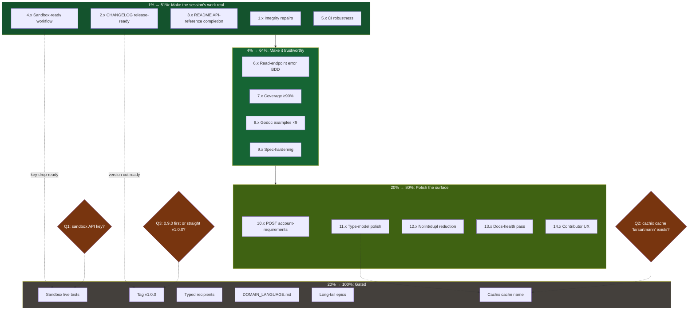

# wise-go Post-Execution Hardening Plan — v0.8.1+ → release

**Date:** 2026-08-21 21:00 CEST
**Inputs:** `docs/status/2026-08-21_20-57_execution-session-self-review.md` (sections a–g: 50 next-work items, 4 partials, 5 gated items, 7 process failures), TODO_LIST.md (2 user-gated items), the v1.0 audit (`docs/reviews/2026-08-21_v1.0-api-audit.md` — green).
**Baseline:** 31 endpoint methods / 14 resources, 121 BDD specs, 86.9% coverage, 0 lint issues, `nix flake check` green, 19 unpushed commits on master.

**Customer:** the Go developer moving money through wise-go (consumer #1: Lars's bank-sync). Value = integrity × discoverability × trust × release-readiness, in that order — the execution session bought capability; this plan converts it into a shippable, documented, verified release.

---

## Pareto Breakdown

### The 1% that delivers 51% — MAKE THE SESSION'S WORK REAL

The execution session shipped 13 methods and 2 behavioral changes that are currently **invisible or unsafe to consume**: a README that documents ~40% of the surface, an `[Unreleased]` changelog hiding behavior changes in Added bullets, my own fresh count error in the plan doc, and a CI badge/cachix pair that degrades silently. Fixing the paper trail + release packaging is tiny effort and is the difference between "work done" and "value delivered".

### The 4% that delivers 64% (cumulative) — MAKE IT TRUSTWORTHY

Error-path coverage for the 9 NEW read endpoints (the matrix covered writes only), coverage push 86.9→90% over the uncovered arms of the new plumbing (`getRaw`, `classifyExhaustedRetries`, `executeWithLogging`), godoc examples for every new method, and spec-hardening (469-day interval, `statementLocale`, rates-UTC regression, binary statement formats). Plus the sandbox workflow skeleton so live verification is a key-drop away.

### The 20% that delivers 80% (cumulative) — POLISH THE SURFACE

POST account-requirements (completes the recipient two-pass story), type-model polish (`AccountID` brand, `X-Delivery-Id` constant, flattening docs, error-text tidy), nolint/dupl reduction, docs-health pass (release history, AGENTS additions), contributor UX (devShell lychee, README drift-guard).

### The other 20% → 100% — GATED WORK (do NOT fake-schedule)

- **Sandbox live tests** — blocked on sandbox API key (question g1). Task 4 makes it key-drop-ready.
- **v1.0.0 tag** — blocked on user approval of the green audit + version call (question g3).
- **Typed recipient `Details`** — blocked on the typed-vs-map decision (question g3-adjacent, carried across four reports).
- **`docs/DOMAIN_LANGUAGE.md`** — blocked on create-or-decline decision.
- **Long-tail epics** — WithMetrics, `Page[T]`, property tests, service-client refactor, tier-3/4 APIs. Demand-gated.
- **Cachix cache name/auth** — blocked on question g2; CI step degrades to warn until answered.

---

## Table A — Comprehensive Plan (14 executable tasks, 30–90 min each)

Sorted: Pareto tier → impact → effort. **Effort** in minutes. `Gate` = per-task quality gates.

| #  | Task                                                                                                                                                                                                                | Tier   | Impact   | Effort | Depends on | Gates                       |
| -- | ------------------------------------------------------------------------------------------------------------------------------------------------------------------------------------------------------------------- | ------ | -------- | ------ | ---------- | --------------------------- |
| 1  | Integrity repairs: fix the 77→80 count in the plan doc, re-derive stale FEATURES line refs, ROADMAP axis-2 stale spots, trash stale coverage artifacts                                                              | **1%** | Critical | 30     | —          | docs + link check           |
| 2  | CHANGELOG release-readiness: "Behavior changes" call-out block (retry typing, GetBalance direct endpoint), restructure `[Unreleased]` for a clean version cut, dual-version (0.9.0 vs 1.0.0) header note pending g3 | **1%** | Critical | 45     | —          | docs + audit cross-check    |
| 3  | README API-reference completion: Users, Statements, MCA/bank details, Balances expansion, Currencies sections + TOC + SCA-correlation example upgrade + `X-Delivery-Id` idempotency note                            | **1%** | Critical | 90     | —          | docs + link check           |
| 4  | Sandbox-ready live-test workflow: `workflow_dispatch` skeleton, key-from-secret, skip-when-absent Go guard, README section                                                                                          | **1%** | Critical | 60     | —          | CI YAML + build + doc       |
| 5  | CI robustness: badge-push race hardening (`pull --rebase` + concurrency), cachix warn-not-fail until g2, govulncheck verbose artifact                                                                               | **1%** | High     | 45     | —          | CI YAML validate            |
| 6  | Error-path BDD for the new read endpoints: GetStatement 404/SCA, MCA + bank details 404, users auth, currencies/total-funds errors                                                                                  | 4%     | High     | 60     | —          | tests only                  |
| 7  | Coverage push ≥90%: `getRaw` arms, `classifyExhaustedRetries` unit tests, `executeWithLogging` transport-error arm, `parseWiseDate` direct table, measure + record                                                  | 4%     | High     | 90     | —          | tests + coverage report     |
| 8  | Godoc examples for the 9 remaining new methods (GetStatement, webhooks, CreateBalance, GetTotalFunds, GetMe, GetUser, MCA, bank details, currencies)                                                                | 4%     | Medium   | 45     | —          | examples                    |
| 9  | Spec-hardening: 469-day interval validation, `statementLocale` param, exchange-rate UTC regression test, MT940/QIF BDD, AGENTS `Accept-Minor-Version` convention                                                    | 4%     | High     | 90     | —          | full test set               |
| 10 | POST account-requirements refresh endpoint (recipient-side two-pass flow) — full gate set                                                                                                                           | 20%    | High     | 75     | —          | full                        |
| 11 | Type-model polish: `AccountID` branded type (additive), `HeaderDeliveryID` constant, `FundingResponse` flattening doc, `parseWiseTimestamp` error-text tidy                                                         | 20%    | Medium   | 60     | —          | full test set               |
| 12 | Nolint/dupl reduction: extract the shared zero-ID-rejection/get-by-ID template (if <30 lines) or document the deferral to the service-client refactor                                                               | 20%    | Medium   | 45     | —          | lint 0 + no behavior change |
| 13 | Docs-health pass: ROADMAP release-history row, AGENTS additions (badge job, examples nolint context), FEATURES examples row                                                                                         | 20%    | Medium   | 45     | 1, 2       | docs + link check           |
| 14 | Contributor UX: lychee in devShell, README drift-guard test (code fences reference real symbols), CONTRIBUTING `nix flake check` note                                                                               | 20%    | Low      | 45     | —          | tests + flake check         |

**Executable subtotal (1–14): 825 min ≈ 13.75 h focused work.** Tasks 1–5 (the 1%): ~4.5 h.

**Gated (NOT scheduled):** G1 sandbox live tests (key), G2 v1.0.0 tag (approval + version call), G3 typed recipients (decision), G4 DOMAIN_LANGUAGE.md (decision), G5 long-tail epics (demand), G6 cachix name/auth (g2).

---

## Table B — Fine-Grained Plan (60 tasks, ≤12 min each)

### Tier 1% — make the session's work real (23 tasks)

| ID  | Task                                                                                             | ≤min | Impact   |
| --- | ------------------------------------------------------------------------------------------------ | ---- | -------- |
| 1.1 | Fix "77" → "80" in the plan doc Execution Result; verify against the plan's own totals line      | 3    | Critical |
| 1.2 | Re-derive stale `file:line` refs in FEATURES.md (balances filter line, others shifted today)     | 10   | High     |
| 1.3 | Fix ROADMAP axis-2 "today" paragraphs still describing the 18-method state                       | 8    | High     |
| 1.4 | Trash stale `coverage/coverage.out`, `reports/coverage.out`, `result/coverage.out`               | 3    | Low      |
| 2.1 | Add "Behavior changes" call-out block to CHANGELOG `[Unreleased]` (retry typing, GetBalance)     | 8    | Critical |
| 2.2 | Restructure `[Unreleased]` Added/Changed/Fixed into version-cut-ready form                       | 10   | Critical |
| 2.3 | Add dual-version header note (0.9.0 vs 1.0.0) pending the user's g3 call                         | 4    | High     |
| 3.1 | README Users section (GetMe/GetUser + UserDetails) + TOC entry                                   | 10   | Critical |
| 3.2 | README Statements section (six formats, `getRaw`, 469-day note) + TOC entry                      | 10   | Critical |
| 3.3 | README MCA + bank-details section (self-RecipientID top-up flow) + TOC entry                     | 10   | Critical |
| 3.4 | README Balances-expansion section (CreateBalance, direct GetBalance semantics, TotalFunds) + TOC | 10   | Critical |
| 3.5 | README Currencies section + TOC entry                                                            | 5    | Medium   |
| 3.6 | Upgrade SCA example: add `WithRequestCorrelationID` to the OTT retry flow                        | 8    | High     |
| 3.7 | Webhooks section: `X-Delivery-Id` idempotency guidance (`HeaderDeliveryID` arrives in 11.x)      | 8    | High     |
| 4.1 | `.github/workflows/sandbox-live.yml`: workflow_dispatch, key from secrets, skip guard            | 12   | Critical |
| 4.2 | `sandbox_live_test.go` skeleton: `t.Skip` unless `WISE_SANDBOX_API_KEY` set; GetMe smoke test    | 12   | Critical |
| 4.3 | Wire the live test into the workflow job with `GOEXPERIMENT=jsonv2`                              | 6    | High     |
| 4.4 | README "Sandbox verification" section (how to run locally + CI)                                  | 8    | High     |
| 4.5 | Add `sandbox_live_test.go` to flake fileset; build immediately                                   | 4    | Critical |
| 5.1 | Badge job: `git pull --rebase` before push + per-run concurrency group                           | 8    | High     |
| 5.2 | Cachix step: `continue-on-error` + comment pointing at open question g2                          | 6    | High     |
| 5.3 | govulncheck job: upload `-show verbose` output as a CI artifact                                  | 8    | Medium   |
| 5.4 | Validate both workflow YAMLs (`python -c yaml.safe_load`) + commit                               | 4    | High     |

### Tier 4% — make it trustworthy (20 tasks)

| ID  | Task                                                                             | ≤min | Impact |
| --- | -------------------------------------------------------------------------------- | ---- | ------ |
| 6.1 | GetStatement 404 + SCA-403 BDD                                                   | 10   | High   |
| 6.2 | GetMultiCurrencyAccount + GetBankAccountDetails 404 BDD                          | 10   | High   |
| 6.3 | GetMe 401 + GetUser 403-plain (non-SCA) BDD                                      | 10   | High   |
| 6.4 | ListCurrencies + GetTotalFunds 401/404 BDD                                       | 10   | High   |
| 6.5 | Add the new-read error matrix rows to FEATURES                                   | 6    | Medium |
| 7.1 | `getRaw` unit tests: transport error arm, empty-body happy path                  | 10   | High   |
| 7.2 | `classifyExhaustedRetries` unit tests: non-exceeded error, nil LastResult        | 10   | High   |
| 7.3 | `executeWithLogging` transport-error arm test (logger sees Status 0 + Error)     | 10   | High   |
| 7.4 | `parseWiseDate` direct unit table: empty, valid, garbage, UTC assertion          | 8    | High   |
| 7.5 | Webhook edge tests: empty payload, huge payload                                  | 8    | Medium |
| 7.6 | Measure coverage; record number in status report (badge updates via CI)          | 4    | High   |
| 8.1 | Examples batch 1: GetStatement, VerifyWebhookSignature, ListCurrencies           | 10   | Medium |
| 8.2 | Examples batch 2: CreateBalance, GetTotalFunds, GetBalance-direct                | 10   | Medium |
| 8.3 | Examples batch 3: GetMe, GetUser, GetMultiCurrencyAccount, GetBankAccountDetails | 12   | Medium |
| 9.1 | `GetStatementRequest.validate`: 469-day max interval + tests                     | 10   | High   |
| 9.2 | `statementLocale` query param on GetStatement + BDD                              | 10   | High   |
| 9.3 | Exchange-rate `time` param UTC-Z regression test (v0.8.1 class)                  | 8    | High   |
| 9.4 | MT940 + QIF BDD (binary formats currently untested)                              | 10   | Medium |
| 9.5 | AGENTS.md: `Accept-Minor-Version` convention entry                               | 5    | Medium |
| 9.6 | Full suite + lint re-run at tier boundary                                        | 4    | High   |

### Tier 20% — polish the surface (17 tasks)

| ID   | Task                                                                                     | ≤min | Impact |
| ---- | ---------------------------------------------------------------------------------------- | ---- | ------ |
| 10.1 | POST account-requirements: raw + public types                                            | 10   | High   |
| 10.2 | Client method `RefreshQuoteAccountRequirements` + validation                             | 10   | High   |
| 10.3 | BDD: refresh reveals new fields (two-pass recipient flow)                                | 12   | High   |
| 10.4 | Mapper/unit tests + corruption classification                                            | 8    | Medium |
| 10.5 | Doc rows (FEATURES/CHANGELOG/TODO) + flake fileset + build                               | 8    | High   |
| 11.1 | `AccountID` branded type + `NewAccountID` (additive; used by MCA)                        | 8    | Medium |
| 11.2 | `HeaderDeliveryID` constant + README webhook section wiring                              | 6    | Medium |
| 11.3 | `FundingResponse` flattening tradeoff doc (oneOf → one struct, why safe)                 | 6    | Medium |
| 11.4 | `parseWiseTimestamp` error text: summarize layouts tried, drop the error-chain dump      | 8    | Low    |
| 12.1 | Attempt shared zero-ID/get-by-ID template extraction (<30 lines, else document deferral) | 12   | Medium |
| 12.2 | Remove the two `dupl` nolints if extraction lands; else annotate the deferral            | 6    | Medium |
| 13.1 | ROADMAP release-history row for the unreleased batch (version TBD via g3)                | 6    | Medium |
| 13.2 | AGENTS.md: badge-job + examples-nolint context entries                                   | 8    | Medium |
| 13.3 | FEATURES.md: godoc-examples inventory row                                                | 5    | Low    |
| 14.1 | devShell: add `lychee` package for local link checks                                     | 5    | Low    |
| 14.2 | README drift-guard test: parse code fences, assert symbols exist (`go doc`)              | 12   | Medium |
| 14.3 | CONTRIBUTING: document the `nix flake check` links gate + lychee local run               | 6    | Low    |

**Totals — derived from the tables above:** Tier 1%: 23 tasks; Tier 4%: 20 tasks; Tier 20%: 17 tasks → **60 tasks, ≤12 min each ≈ 8.5 h focused work** (Table A's 825 min is the same work coarser-sliced).

---

## Execution Graph

Execution order is table order; hard edges only where drawn (docs before the tag, workflow before live tests). Tasks 1–5 ship first as one verification unit.

---

## Verschlimmbesserung Guards (what we will NOT do)

1. **No tagging** — v1.0.0 (or 0.9.0) ships only on the user's explicit version call (g3). The changelog is prepared, the tag is not created.
2. **No breaking API changes** — everything in this plan is additive or documentation; `AccountID` is a new type, not a retrofit of existing signatures.
3. **No fake scheduling of gated work** — G1–G6 stay gated; task 4 makes G1 _ready_ without pretending the key exists.
4. **Verify external identifiers before writing** — no invented commit SHAs, header names, or endpoint paths; anything from outside the repo gets checked against the spec/gh before it lands (the cachix incident rule).
5. **Derive every count at write time** — any number in docs/commits comes with the command that produced it (the 68/77/80 lesson).
6. **No touching the curated `.golangci.yml`**; nolint reductions only via real refactors or documented deferrals.
7. **No service-client refactor, no `Page[T]`, no `Money` arithmetic** — guards carried over unchanged.

## Verification Gates (per task group)

- Build after any fileset-affecting change: `GOEXPERIMENT=jsonv2 go build ./...` immediately.
- Tests: `GOEXPERIMENT=jsonv2 go test -race -count=1 ./...` per group; lint `golangci-lint run` (0 issues); `nix flake check` at tier boundaries.
- CI YAML changes: `python -c "import yaml; yaml.safe_load(...)"` before commit.
- Docs: FEATURES/CHANGELOG/README rows land in the same task; lychee gate in `nix flake check` must stay green.
- Commit per group with detailed messages; push at plan completion (user-instructed this session).

---

_Plan complete. Awaiting approval for execution._
