# Pareto Execution Plan: OpenAPI Spec-Conformance Gate → Green → Institutionalized

_Created 2026-09-16 16:54 CEST · Scope: finish the Wise OpenAPI spec-conformance work started this session_
_Format note: `.md` written because the user explicitly requested Markdown + mermaid/d2; the pareto-planning skill's canonical format is HTML (override flagged per skill contract)._

---

## Current State (baseline, verified)

- Conformance gate exists and runs; suite at **162/202 passing**, 40 failures, **every failure root-caused** (status report: `docs/status/2026-09-16_16-45_openapi-spec-conformance-status.md`).
- 3 real client bugs already fixed in code (statement `type` filter → `StatementType`, `CreateBalance` `X-idempotence-uuid` header, statement `details.type` spec enum), plus text/plain funding-error fixtures.
- Known-blocking: response-side validation `Options` never engaged (harness bug), `omitzero` missing on 3 raw pointer fields, 3 quote fixtures missing `rateType`, rates array-shape divergence (spec=array, SDK parses object), `tmp_probe/` debris, no gofmt/lint/nix/docs wiring yet.
- Daemon committed all WIP (incl. one syntactically broken intermediate) — accepted, documented; no history rewrites.

## Pareto Breakdown

| Tier | Work | Delivers | Why |
|---|---|---|---|
| **1%** | Pass `conformanceOptions()` to `ResponseValidationInput.Options` (one line) | **~51%** | Un-engages the permissive `date-time` validator + `MultiError` on the response side — the single cause behind the majority of the 40 remaining failures. |
| **4%** | 1% **+** `omitzero` on nullable raw pointer fields **+** `rateType: FIXED` in 3 quote fixtures **+** rerun loop | **~64%** | Suite reaches **202/202**: the gate actually functions end-to-end. That is the session's core deliverable. |
| **20%** | 4% **+** rates array fix **+** hygiene (tmp_probe, ids_test, gofmt, lint, go.mod verdict, flake fileset + vendorHash so `nix flake check` gates it) **+** AGENTS/CHANGELOG knowledge transfer | **~80%** | Green AND durable: reproducible in the Nix sandbox, lint-clean, documented for the next session. |
| **remaining 80%** | Coverage calibration, README/FEATURES/TODO_LIST/ROADMAP harvest, doc-verify, apidiff, negative self-test, backlog seeds (paginated accounts, CI re-enable, spec-refresh tooling, Q4 rollover, sandbox live verification) | **100%** | Turns a green gate into an institutionalized contract-testing practice. |

## Assumptions & Decisions (until overridden)

1. **Q4 rollover deferred** — `quarterlyAPIVersion` stays `2026Q3` (live-verified); flip becomes its own verified change. Snapshot stays Q3-pinned.
2. **`StatementType` breaking-ish change stands** (0.x convention, already implemented; CHANGELOG documents it).
3. **Rates fix is lenient-by-design** — parse spec array first, tolerate single-object (same doctrine as `parseWiseTimestamp`: Wise's wire is historically inconsistent). Cannot regress live behavior: if live sends arrays, today's object parse is already broken; if it sends objects, the fallback preserves it.
4. **Sandbox live verification is a gated task** — runs only if `WISE_SANDBOX_API_KEY` is present; otherwise recorded as the top open risk.

---

## Table A — Comprehensive Plan (30–100 min tasks, ALL todos, impact-sorted)

| # | Task | Effort | Impact | Customer value | Includes |
|---|---|---|---|---|---|
| A1 | **Green sweep**: response `Options` fix, `omitzero` raw tags, `rateType` fixtures, iterate to 202/202 | 60–90m | Critical | Gate functions; spec-conformant fixtures | M01–M10 |
| A2 | **Rates array-shape fix** (probable live bug): array parse + tolerant fallback + fixtures + unit tests | 30–45m | Critical | Correct live parsing of `/v1/rates` | M11–M14 |
| A3 | **Hygiene**: delete `tmp_probe`, `ids_test.go` for `newRequestUUID`, calibrate coverage floors, `-v`-confirm guard | 30–45m | High | Trustworthy, debris-free repo | M15–M19 |
| A4 | **BuildFlow quality pass**: format, golangci-lint, gomod-check (+ verdict on new indirect deps) | 45–60m | High | Lint-clean, dependency hygiene | M20–M25 |
| A5 | **Nix wiring**: spec JSON into Go fileset, vendorHash via nix-hash-fix, `nix flake check` green | 45m | High | Gate enforced in hermetic sandbox/CI | M26–M29 |
| A6 | **AGENTS.md knowledge transfer**: spec URL + Q4 status, harness architecture, exemption ledger, fixture-fidelity policy, daemon-WIP note | 45–60m | High | Next session starts knowing everything | M30–M34 |
| A7 | **CHANGELOG/FEATURES/README**: breaking changes, new API surface, conformance testing docs | 30–45m | Medium-High | Users see what changed and why | M35–M38 |
| A8 | **TODO_LIST/ROADMAP harvest + doc-verify + apidiff** | 30–45m | Medium | Living docs stay authoritative | M39–M43 |
| A9 | **Harness negative self-test** (gate must FAIL a deliberately invalid exchange) | 30m | Medium | The gate can never silently rot | M44–M45 |
| A10 | **Commit-per-task + final push** (detailed messages, per user instruction) | 30m | Medium | Reviewable history | M46–M48 |
| A11 | Backlog seeds parked to TODO_LIST/ROADMAP (not this session): sandbox live verification, Q4 rollover, spec-refresh tooling, paginated `/accounts` migration, CI re-enable, upstream docs feedback, MultiError formatting, header-casing live check, raw.Balance field audit, single-balance `?types=` check, balance-movements/card-orders endpoints, statement-formats upstream promotion, DetailType deprecation comments, raw request-null sweep, godoc/CONTRIBUTING notes | 30m (seeding only) | Medium (later High) | Nothing forgotten | M49–M55 |

## Table B — Micro-Tasks (≤12 min each, ALL todos, execution order)

| ID | Micro-task (≤12 min) | Parent | Impact | Verify by |
|---|---|---|---|---|
| M01 | Pass `conformanceOptions()` to `ResponseValidationInput.Options`; `go build` | A1 | Critical | build |
| M02 | Full suite run; count remaining failures (expect date-time cleared) | A1 | Critical | go test |
| M03 | `omitzero` on `raw.TransferRequirementField` nullable pointers (`displayFormat`, `validationRegexp`, `example`, audit siblings) | A1 | High | go test |
| M04 | Add `RateType: "FIXED"` to 3 quote fixtures | A1 | High | go test |
| M05 | Suite run; classify anything new (MultiError now reveals grouped errors) | A1 | High | go test |
| M06 | Rates: switch to `[]raw.ExchangeRate` parse, pick matching entry, tolerant single-object fallback | A2 | Critical | build |
| M07 | Rates fixtures → spec array shape; add lenient single-object unit test | A2 | High | go test |
| M08 | Suite run → iterate on stragglers until **202/202** | A1 | Critical | go test |
| M09 | Delete `tmp_probe/`; confirm no references | A3 | Medium | build |
| M10 | Calibrate coverage floors to actuals; keep vacuous-pass guards | A3 | Medium | go test -v |
| M11 | `ids_test.go`: `newRequestUUID` format/v4-bits/uniqueness | A3 | Medium | go test |
| M12 | `go test ./...` + `-race` full-repo green checkpoint | A3 | Critical | go test |
| M13 | `buildflow format`; review diff only | A4 | High | buildflow |
| M14 | `buildflow -s golangci-lint`; fix findings in touched files | A4 | High | buildflow |
| M15 | `buildflow -s gomod-check --fix`; record verdict on `gorilla/mux`+`go-openapi/*` indirects | A4 | Medium | buildflow |
| M16 | Lint re-run to clean; suite still green | A4 | High | go test |
| M17 | `flake.nix`: add `docs/reviews/wise-api-openapi.json` to Go fileset union | A5 | High | edit |
| M18 | `buildflow -s nix-hash-fix --fix` (vendorHash after kin-openapi) | A5 | High | buildflow |
| M19 | `nix flake check` green (sandbox runs the gate) | A5 | Critical | nix |
| M20 | AGENTS.md: spec URL + snapshot-vs-Q4 status + harness architecture section | A6 | High | review |
| M21 | AGENTS.md: exemption ledger + fixture-fidelity policy + StatementType/idempotence notes | A6 | High | review |
| M22 | AGENTS.md: daemon-WIP + kin-openapi dependency entries | A6 | Medium | review |
| M23 | CHANGELOG Unreleased: StatementType break, idempotence header, DetailType constants, rates fix (fold with dprint-covered files) | A7 | Medium | review |
| M24 | FEATURES.md + README conformance-testing section | A7 | Medium | review |
| M25 | TODO_LIST.md harvest from this plan (all parked seeds) | A8 | Medium | review |
| M26 | ROADMAP.md: paginated accounts migration + refresh tooling + Q4 flip entries | A8 | Medium | review |
| M27 | `nix run .#doc-verify` (links + count claims) | A8 | Medium | nix |
| M28 | `nix run .#apidiff` report on the type change (network-permitting) | A8 | Low | nix |
| M29 | Harness negative self-test: `validateExchange` must reject a deliberately bad exchange | A9 | Medium | go test |
| M30 | Sandbox live verification attempt (gated on `WISE_SANDBOX_API_KEY`; else record as top open risk) | A11 | High if key | go test -tags? |
| M31 | git status → detailed commit per completed task-group | A10 | Medium | git |
| M32 | Final `git push` (user-authorized) + verify remote state | A10 | Medium | git |
| M33 | Spec-refresh tooling seed (script sketch + AGENTS command doc) | A11 | Medium | review |
| M34 | Upstream docs-feedback note drafted (empty `info.version`, statement formats) — park, do NOT file without verify-before-filing | A11 | Low | review |
| M35 | MultiError message readability improvement (trim `Or Error at` dupes) | A11 | Low | go test |
| M36 | Header-casing + `raw.Balance` field audit + single-balance `?types=` checks (spec reads, park findings) | A11 | Low | review |
| M37 | Statement/balance-status enum sweep in fixtures (balance `Status` comment vs spec) | A11 | Low | go test |
| M38 | CONTRIBUTING/godoc note for the conformance gate | A11 | Low | review |
| M39 | `DetailTypeFee`/`DetailTypePayment` deprecation comments | A11 | Low | review |
| M40 | Final full verification: `go build`, `go test ./... -race`, `nix flake check`, buildflow clean | all | Critical | all gates |

## Execution Graph

```mermaid
flowchart TD
    S[Start: 162/202, 40 root-caused failures] --> G0[Commit plan + status report, push]
    G0 --> P1{Phase 1: GREEN}
    P1 --> M01[Response Options fix] --> M02[Suite run]
    M02 --> M03[omitzero raw tags] --> M04[rateType fixtures] --> M05[Suite run]
    M05 --> M06[Rates array + fallback] --> M07[Rates fixtures + unit test] --> M08{202/202?}
    M08 -- no --> M05
    M08 -- yes --> M09[Delete tmp_probe] --> M10[Calibrate floors] --> M11[ids_test] --> M12[Full repo race test]
    M12 --> P2{Phase 2: DURABLE}
    P2 --> M13[buildflow format] --> M14[golangci-lint] --> M15[gomod-check] --> M16[Lint clean + green]
    M16 --> M17[flake fileset] --> M18[nix-hash-fix] --> M19{nix flake check?}
    M19 -- no --> M17
    M19 -- yes --> P3{Phase 3: INSTITUTIONALIZED}
    P3 --> M20[AGENTS.md x3] --> M23[CHANGELOG/FEATURES/README] --> M25[TODO_LIST/ROADMAP harvest]
    M25 --> M27[doc-verify] --> M28[apidiff] --> M29[Negative self-test] --> M30[Sandbox attempt gated]
    M30 --> M31[Commits per task] --> M32[Push] --> M40[Final all-gates verification]
    M40 --> DONE[Done: gate green, durable, documented]
```

_Verschlimmbesserung guard: every micro-task above ends in a verification step; no step touches code outside its stated scope; the rates fix is behavior-preserving by construction (lenient fallback); no history rewrites; no config regeneration (`.golangci.yml` curated list is protected)._
