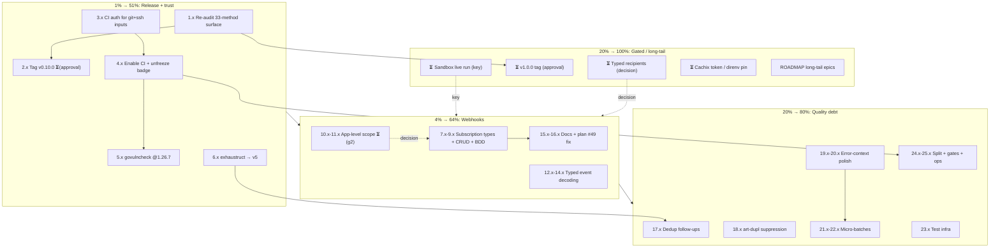

# wise-go Pareto Plan — v0.10 release readiness → webhooks → quality debt

> **EXECUTED — archived 2026-09-16.** Tiers 1%/4%/20% executed in the
> 2026-09-13 sessions (records: `docs/status/2026-09-13_14-16` and `_15-41`);
> the shipped surface landed as v0.10.0 (`fe896a8`) and v0.11.0 (`5a6448c`,
> 2026-09-14: webhook subscriptions, typed event decoding, OTT endpoints,
> `WithUserAgent`, `Profile.UserID`/`PublicID`). Task 17.5/17.6 were REFUTED by
> spec verification (declined, see 14-16 §a.12); 22.2–22.4 declined with
> rationale. Remaining gated work (sandbox key, v1.0.0 tag, typed recipients,
> Cachix, direnv pin) is tracked in `TODO_LIST.md` P2; CI pins + erraudit gate
>
> - coverage-floor parity in P1/P3. Nothing actionable is lost here.

**Date:** 2026-09-13 12:32 CEST
**Inputs:** `TODO_LIST.md` (rebuilt 2026-09-13 docs-health pass: P1 release, P2 user-gated, P3 webhooks, P4 tooling/quality), `ROADMAP.md` (4 axes), `docs/status/2026-09-13_12-29_docs-health-audit-archive-and-living-doc-overhaul.md` (f-list, 50 items), the v1.0 audit (`docs/reviews/2026-08-21_v1.0-api-audit.md` — green, predates 3 methods).
**Baseline:** v0.10.0 shipped-in-docs but **untagged** (`fe896a8`); 33 endpoint methods / 14 resources; 91.3% local coverage (badge frozen at 86.9% — CI disabled on GitHub since 2026-07-05); 0 lint issues; `nix flake check` green; v1.0 audit stale by 3 methods.

**Customer:** the Go developer moving money through wise-go (consumer #1: Lars's bank-sync). Value = release integrity × trust infrastructure × safe growth, in that order. Everything needed to _prove_ the built SDK is shippable already exists — the 1% converts it into a tagged, CI-verified release.

---

## Pareto Breakdown

### The 1% that delivers 51% — RELEASE THE BUILT SURFACE + RESTORE TRUST INFRASTRUCTURE

The SDK's last three releases (v0.8.0→v0.10.0) shipped 15 methods with zero released trust artifacts: no tag for v0.10.0, a v1.0 audit that predates 3 methods, and a CI workflow that has not run since July (badge frozen, govulncheck/lychee/cachix dormant). Audit → tag → CI-on is roughly a day of work and converts "capability" into "a release a consumer can bet on". Nothing else on the backlog changes the product's credibility; this does.

### The 4% that delivers 64% (cumulative) — GROW THE NEXT SURFACE: WEBHOOKS

Webhook signature verification shipped in v0.9.0, but the _management_ half is still unbuilt: 9 subscription operations across 5 paths (per the OpenAPI spec; the plan doc's #49 wrongly says 8), and zero typed event decoding (consumers hand-decode the verified JSON today). The 2026-08-28 webhooks review already extracted the full breakdown (f.1–22). Profile-level CRUD fits today's user-token client; app-level needs a client-credentials decision (user-gated question).

### The 20% that delivers 80% (cumulative) — QUALITY DEBT + ERGONOMICS

The dedup refactor's follow-ups (requireID tests, fetchByID split brain, `exhaustruct` nolint root-cause), the erraudit error-context polish, the quality micro-batch that has recurred across 8+ reports (classify-cents, wiseDateFormat, WithUserAgent, Stringers, RegisterClassification, Profile.UserID/PublicID), the test-infrastructure gap (benchmarks, fuzz, `internal/raw` tests, concurrent-safety), repo hygiene (templates, ADRs, doc-verify app, test-file split, coverage gate), and the forced linter migration (`exhaustruct` → `exhaustruct_v5`, deprecated in golangci v2.13 — saw the warning live this session).

### The other 20% → 100% — GATED WORK (do NOT fake-schedule)

- ⏳ **Sandbox live run** — key-gated; workflow + skeleton ready (`ecdc738`).
- ⏳ **v1.0.0 tag** — after re-audit + explicit approval.
- ⏳ **Typed recipient `Details`** — five-reports-old design decision.
- ⏳ **Cachix token** / ⏳ **direnv GOEXPERIMENT pin** — user env.
- **Long-tail epics** (ROADMAP): WithMetrics, `Page[T]`, property tests, Quote residuals, service-client refactor, tier-3/4 APIs (addresses, balance-capacity, batch groups, OAuth, 2026Q4 versioning), `Authenticate()` future, blog post, `nix flake check --all-systems`.

---

## Table A — Comprehensive Plan (25 executable tasks, 30–100 min each)

Sorted: Pareto tier → impact → effort. **Effort** in minutes. `Gate` = per-task quality gates. Gated work (Table A #26–27) is deliberately NOT decomposed — slicing speculation into 12-minute rows is Verschlimmbesserung.

| #  | Task                                                                                                                                                                                                                                                                | Tier   | Impact   | Effort | Depends on | Gates                    |
| -- | ------------------------------------------------------------------------------------------------------------------------------------------------------------------------------------------------------------------------------------------------------------------- | ------ | -------- | ------ | ---------- | ------------------------ |
| 1  | Re-run the v1.0 API audit over the 33-method surface: `go doc -all` inventory, godoc pass over the 3 new methods, refreshed breaking-change risk register                                                                                                           | **1%** | Critical | 60     | —          | audit doc + lint         |
| 2  | Prepare + tag `v0.10.0`: verify CHANGELOG completeness + receipt BDD coverage, draft release notes, annotated tag **(execution gated on user approval)**                                                                                                            | **1%** | Critical | 30     | 1          | test + lint + flake      |
| 3  | CI authentication for `git+ssh://` flake inputs: choose deploy-key vs `GITHUB_TOKEN`+`insteadOf`, wire into the `nix:` job, validate YAML                                                                                                                           | **1%** | Critical | 60     | —          | YAML + local flake check |
| 4  | Re-enable the CI workflow on GitHub, watch the first run green (unfreezes coverage badge + restores govulncheck/lychee/cachix jobs)                                                                                                                                 | **1%** | Critical | 30     | 3          | green CI run             |
| 5  | Re-run `govulncheck` on go1.26.7, record zero-findings evidence (TODO P4)                                                                                                                                                                                           | **1%** | High     | 30     | 4          | recorded output          |
| 6  | Migrate `exhaustruct` → `exhaustruct_v5` in `.golangci.yml` (forced: v2.13 deprecation), fix any findings                                                                                                                                                           | **1%** | High     | 30     | —          | lint 0                   |
| 7  | Webhook subscriptions: extract schemas from `wise-api-openapi.json` (5 paths, 9 ops), raw + public `WebhookSubscription`, branded `WebhookSubscriptionID` (verify int64 vs UUID first)                                                                              | 4%     | Critical | 90     | —          | full gate set            |
| 8  | Profile-level CRUD: `Create/List/Get/Delete ProfileWebhookSubscription` + request type + zero-ID validations                                                                                                                                                        | 4%     | Critical | 90     | 7          | full gate set            |
| 9  | BDD for the 4 profile ops: happy paths + 400/401/404 + (204 delete) + zero-ID rejections                                                                                                                                                                            | 4%     | High     | 60     | 8          | tests green              |
| 10 | App-level scope decision: client-credentials token story (question g2 from the 08-28 report) — implement or document deferral in ROADMAP                                                                                                                            | 4%     | High     | 60     | —          | decision recorded        |
| 11 | `TestWebhookSubscription` (`POST .../test-notifications`) — only if app-level in scope (10)                                                                                                                                                                         | 4%     | Medium   | 30     | 10         | full gate set            |
| 12 | Typed webhook events: enumerate `webhook-event` schemas, `WebhookEvent` envelope, `WebhookEventType` enum, `ParseWebhookEvent` dispatch                                                                                                                             | 4%     | High     | 90     | —          | full gate set            |
| 13 | Event payload structs (high-value four: transfers#state-change, balances#credit, deposits#completed, deposits#top-up-failed) + per-type fixtures                                                                                                                    | 4%     | High     | 90     | 12         | tests green              |
| 14 | Forward compatibility: unknown-event-type passthrough test, malformed-envelope Corruption tests, tolerant timestamps via `parseWiseTimestamp`                                                                                                                       | 4%     | Medium   | 45     | 12         | tests green              |
| 15 | Godoc examples (subscriptions + `ParseWebhookEvent`) + README "Webhook subscriptions" + events section + TOC entries                                                                                                                                                | 4%     | Medium   | 60     | 8, 13      | links check              |
| 16 | Doc corrections: plan item #49 "8" → 9 operations annotate, FEATURES/CHANGELOG/TODO rows, flake fileset, full gate run                                                                                                                                              | 4%     | Medium   | 30     | 8          | race + lint + flake      |
| 17 | Dedup follow-ups: `requireID` table test (int64 + string + contract pin), route `fetchByID` through `requireID`, verify spec accepts `sourceOfFundsOther`/`transferNature` on create, add both fields to `CreateTransferRequest`, delete the `//nolint:exhaustruct` | 20%    | High     | 100    | 6          | race + lint 0            |
| 18 | art-dupl: inspect the 6 suppressed clone groups, judge each, add a suppression file for the 3 accepted mirrors                                                                                                                                                      | 20%    | Medium   | 60     | —          | art-dupl 0 actionable    |
| 19 | Error-context polish: `readBody` error capture (`client.go:382`), raw-input values in `map*` errors, `ErrorContext` on `AuthError`/`NotFoundError`                                                                                                                  | 20%    | Medium   | 100    | —          | race + lint              |
| 20 | AGENTS error-context convention + `requireNonEmpty` two-idiom decision (or explicit "why not")                                                                                                                                                                      | 20%    | Medium   | 30     | 19         | docs                     |
| 21 | Quality micro-batch A: `classifyTransactionType` cents signature, `wiseDateFormat` constant, surface `Profile.UserID`/`PublicID`                                                                                                                                    | 20%    | Medium   | 90     | —          | race + lint              |
| 22 | Quality micro-batch B: `WithUserAgent` option, `fmt.Stringer` for the public enums, `errorfamily.RegisterClassification` call                                                                                                                                       | 20%    | Low      | 90     | —          | race + lint              |
| 23 | Test infrastructure: benchmarks (Cents, classify/map), fuzz (timestamps, currency), `internal/raw` test file, client concurrent-safety test                                                                                                                         | 20%    | Low      | 100    | —          | tests green              |
| 24 | Test-file split (`errors_test.go`, `helpers_test.go`), coverage-threshold CI step, gorelease/apidiff breaking-change check                                                                                                                                          | 20%    | Low      | 100    | 4          | CI green                 |
| 25 | Contributor/ops: issue + PR templates, ADR dir (001 Money, 002 flat package, 003 go-retry override rationale), `doc-verify` flake app, `reports/jscpd` cleanup                                                                                                      | 20%    | Low      | 100    | 4          | flake check              |
| 26 | ⏳ **Sandbox first live run + CHANGELOG entry** — **BLOCKED: needs `WISE_SANDBOX_API_KEY`**                                                                                                                                                                         | Rest   | Critical | —      | user key   | —                        |
| 27 | ⏳ **Gated bundle**: v1.0.0 tag (after 1–5 + approval) · typed-recipients decision · Cachix token · direnv GOEXPERIMENT pin · long-tail epics (ROADMAP)                                                                                                             | Rest   | High     | —      | user       | —                        |

**Executable subtotal (1–25): ~20.5 h focused work.** Tasks 1–6 (the 1%): ~4 h.

---

## Table B — Fine-Grained Plan (106 tasks, ≤12 min each)

Sorted within tier by execution order. Gated work (#26–27 above) is not decomposed.

### Tier 1% — release + trust (23 tasks)

| ID  | Task                                                                                                                 | ≤min | Impact   |
| --- | -------------------------------------------------------------------------------------------------------------------- | ---- | -------- |
| 1.1 | `go doc -all` inventory → diff exported symbols against the audit's 31-method list                                   | 12   | Critical |
| 1.2 | Update the audit doc: surface counts 31→33 methods / refreshed type count, note the growth lineage                   | 10   | Critical |
| 1.3 | Godoc pass over the 3 new methods (`RefreshQuoteAccountRequirements`, `GetTransferReceipt`, `GetTransferPayoutInfo`) | 12   | High     |
| 1.4 | Risk register refresh: receipt-404 semantics, payout MT103 nilability, refresh two-pass flow                         | 10   | High     |
| 1.5 | Cross-check FEATURES/README claims against the refreshed inventory (drift guard)                                     | 8    | Medium   |
| 1.6 | Commit the audit update; race + lint gates                                                                           | 8    | High     |
| 2.1 | Verify `[0.10.0]` CHANGELOG completeness against `fe896a8` diff + receipt BDD coverage exists                        | 10   | Critical |
| 2.2 | Draft v0.10.0 release notes from the CHANGELOG section                                                               | 10   | High     |
| 2.3 | Create annotated tag `v0.10.0` — ⏳ EXECUTION GATED on user approval                                                 | 5    | Critical |
| 2.4 | Push tag; verify proxy.golang.org `@v/list` + clean-dir `go get module@v0.10.0` consumer test                        | 10   | High     |
| 3.1 | Choose CI auth strategy (deploy key vs `GITHUB_TOKEN` + `insteadOf`) — write the decision down                       | 10   | Critical |
| 3.2 | Collect/rotate the secret(s) — ⏳ needs user for repo-secret values                                                  | 12   | Critical |
| 3.3 | Add the SSH/insteadOf step to the `nix:` job in ci.yml (no key material in repo)                                     | 12   | Critical |
| 3.4 | Reproduce CI's fetch locally (`GIT_SSH_COMMAND` + `nix flake check`) to prove auth works                             | 12   | High     |
| 3.5 | Validate ci.yml YAML + commit                                                                                        | 4    | High     |
| 4.1 | Enable the workflow via `gh api` (PUT .../workflows/ci.yml/enable) + trigger a dispatch/push                         | 8    | Critical |
| 4.2 | Watch the first run; triage any nix/GOEXPERIMENT fallout                                                             | 12   | Critical |
| 4.3 | Confirm coverage-badge job pushes a fresh badge (unfreeze verified)                                                  | 8    | High     |
| 5.1 | Run `govulncheck ./...` on go1.26.7                                                                                  | 8    | High     |
| 5.2 | Record zero-findings (or triage) in TODO_LIST P4 + AGENTS govulncheck note                                           | 8    | Medium   |
| 6.1 | Read exhaustruct_v5 config differences; update `.golangci.yml` (keep the curated-list guard)                         | 10   | High     |
| 6.2 | Run `golangci-lint run`; fix or annotate findings                                                                    | 12   | High     |
| 6.3 | Full gate: race + `nix flake check` after the linter migration                                                       | 8    | High     |

### Tier 4% — webhooks (49 tasks)

| ID   | Task                                                                                                | ≤min | Impact   |
| ---- | --------------------------------------------------------------------------------------------------- | ---- | -------- |
| 7.1  | Extract the 5 subscription paths + 9 operations from `wise-api-openapi.json`                        | 12   | Critical |
| 7.2  | Determine the subscription ID wire type (int64 vs UUID) — spec is authoritative                     | 8    | Critical |
| 7.3  | `internal/raw` wire type for subscription create/response                                           | 10   | Critical |
| 7.4  | Public `WebhookSubscription` result type + mapper                                                   | 12   | Critical |
| 7.5  | `WebhookSubscriptionID` branded ID (+ Brand phantom)                                                | 8    | Critical |
| 7.6  | `CreateWebhookSubscriptionRequest` + client-side validation                                         | 12   | High     |
| 7.7  | Flake fileset additions + immediate `go build`                                                      | 6    | Critical |
| 8.1  | `CreateProfileWebhookSubscription(ctx, ProfileID, req)`                                             | 12   | Critical |
| 8.2  | `ListProfileWebhookSubscriptions(ctx, ProfileID)` (+ pagination shape check)                        | 10   | Critical |
| 8.3  | `GetProfileWebhookSubscription(ctx, ProfileID, WebhookSubscriptionID)`                              | 10   | Critical |
| 8.4  | `DeleteProfileWebhookSubscription` (204 handling)                                                   | 10   | Critical |
| 8.5  | Wire-path unit checks (paths, methods, bodies) for all four                                         | 10   | High     |
| 9.1  | BDD: create happy path + 400 validation                                                             | 12   | High     |
| 9.2  | BDD: list happy path + empty list                                                                   | 8    | High     |
| 9.3  | BDD: get happy + 404                                                                                | 8    | High     |
| 9.4  | BDD: delete 204 + 404                                                                               | 8    | High     |
| 9.5  | BDD: 401 + zero-ID rejections (no network call)                                                     | 10   | High     |
| 10.1 | Write up the token-model options (profile-only vs client-credentials) with consequences             | 12   | High     |
| 10.2 | ⏳ User decision on app-level scope (g2)                                                            | —    | High     |
| 10.3 | Implement app-level CRUD per decision — OR document the deferral in ROADMAP                         | 12   | Medium   |
| 11.1 | `TestWebhookSubscription` method (app-level only per spec)                                          | 10   | Medium   |
| 11.2 | BDD for test-notifications                                                                          | 8    | Medium   |
| 12.1 | Enumerate the full `webhook-event` schema list from the spec (the 6-page extract was incomplete)    | 12   | High     |
| 12.2 | `WebhookEvent` envelope struct (data, subscription_id, event_type, schema_version, sent_at)         | 10   | Critical |
| 12.3 | `WebhookEventType` open enum + documented constants                                                 | 10   | High     |
| 12.4 | `ParseWebhookEvent([]byte)` decode-then-dispatch                                                    | 12   | Critical |
| 12.5 | Wire `parseWiseTimestamp` into `sent_at` (tolerant parsing)                                         | 8    | Medium   |
| 12.6 | Decide envelope strictness: tolerant + `json.RawMessage` data (recommended) — record it             | 8    | Medium   |
| 13.1 | Payload struct: transfers#state-change (resource + currentStatus)                                   | 10   | High     |
| 13.2 | Payload struct: balances#credit                                                                     | 8    | High     |
| 13.3 | Payload struct: deposits#completed                                                                  | 8    | Medium   |
| 13.4 | Payload struct: deposits#top-up-failed                                                              | 8    | Medium   |
| 13.5 | JSON fixtures per event type (spec-derived)                                                         | 12   | High     |
| 14.1 | Unknown-event-type forward-compat test (never error on new Wise events)                             | 10   | High     |
| 14.2 | Malformed-envelope Corruption-classification tests                                                  | 8    | High     |
| 14.3 | VerifyWebhookSignature + ParseWebhookEvent composition guidance (decide vs `VerifyAndParse` helper) | 10   | Medium   |
| 15.1 | Godoc example: subscription create/verify round-trip                                                | 12   | Medium   |
| 15.2 | Godoc example: `ParseWebhookEvent` with BLOCKED-style event handling                                | 10   | Medium   |
| 15.3 | README "Webhook subscriptions" section + TOC entry                                                  | 12   | High     |
| 15.4 | README "Typed event decoding" section — replace the "decode the JSON yourself" hand-wave            | 10   | High     |
| 16.1 | Annotate plan item #49: "8" → 9 operations (docs-health ANNOTATE, inline)                           | 5    | Medium   |
| 16.2 | FEATURES rows (FULLY_FUNCTIONAL) + CHANGELOG entry + TODO_LIST check-off                            | 10   | High     |
| 16.3 | Flake links fileset check for new README anchors                                                    | 6    | Medium   |
| 16.4 | Full gate set: race + lint 0 + `nix flake check`                                                    | 8    | Critical |

### Tier 20% — quality debt + ergonomics (34 tasks)

| ID   | Task                                                                                        | ≤min | Impact |
| ---- | ------------------------------------------------------------------------------------------- | ---- | ------ |
| 17.1 | `TestRequireID`: int64 zero/nonzero rows                                                    | 8    | High   |
| 17.2 | `TestRequireID`: string/`QuoteID` empty/nonempty rows                                       | 8    | High   |
| 17.3 | Pin the requireID error contract (`wise.<domain>.invalid_request` + "<field> is required")  | 8    | High   |
| 17.4 | Change `fetchByID` to take the branded ID + validate via `requireID`; update callers        | 12   | High   |
| 17.5 | Verify in the OpenAPI spec that create accepts `sourceOfFundsOther` + `transferNature`      | 8    | High   |
| 17.6 | Add both fields to `CreateTransferRequest`; `detailsWire` becomes full delegation           | 12   | High   |
| 17.7 | Delete the `//nolint:exhaustruct` (`transfers.go:205`); race + lint gates                   | 6    | High   |
| 18.1 | Run art-dupl with `--include` to list the 6 suppressed groups                               | 10   | Medium |
| 18.2 | Judge each suppressed group (accept/fix), record verdicts                                   | 12   | Medium |
| 18.3 | Add the art-dupl suppression config for the 3 accepted mirrors                              | 10   | Medium |
| 19.1 | `readBody`: capture + include the read error (`client.go:382`)                              | 10   | Medium |
| 19.2 | Raw-input values into `map*` error contexts (transactions.go:93, balances.go:234)           | 12   | Medium |
| 19.3 | `ErrorContext()` on `AuthError`                                                             | 10   | Medium |
| 19.4 | `ErrorContext()` on `NotFoundError` + `IsRetryable` audit across all six types              | 12   | Medium |
| 19.5 | Extend `TestErrorContexts` for the new contexts                                             | 10   | Medium |
| 19.6 | AGENTS.md error-context convention entry                                                    | 8    | Medium |
| 20.1 | `requireNonEmpty` adopt-or-decline + AGENTS.md "why/why not" (kills the two-idiom drift)    | 10   | Medium |
| 20.2 | Prune/verify the AGENTS gotcha list (≤20 rows rule; stale rows out)                         | 10   | Low    |
| 21.1 | `classifyTransactionType(DetailType, totalCents int64)` signature change + call sites       | 12   | Medium |
| 21.2 | Update classifier tests for cents semantics                                                 | 8    | Medium |
| 21.3 | `wiseDateFormat` constant; replace the inline layout in `users.go:139`                      | 5    | Low    |
| 21.4 | Map `Profile.UserID` from raw; document the field                                           | 8    | Medium |
| 21.5 | Map `Profile.PublicID` from raw; document the field                                         | 6    | Medium |
| 22.1 | `WithUserAgent` option + header forwarding + test                                           | 12   | Low    |
| 22.2 | `String()` for `ProfileType` + `BalanceType`                                                | 8    | Low    |
| 22.3 | `String()` for `TransactionType` + remaining small enums                                    | 10   | Low    |
| 22.4 | `errorfamily.RegisterClassification` call in an init/classification file + verify           | 12   | Medium |
| 22.5 | Race + lint gates for the micro-batch                                                       | 6    | High   |
| 23.1 | Benchmarks: `BalanceAmount.Cents`, `classifyTransactionType`, `mapTransaction`              | 12   | Low    |
| 23.2 | Fuzz: `parseWiseTimestamp` (all layouts, zoneless=UTC invariant)                            | 12   | Medium |
| 23.3 | Fuzz: `NewCurrency`/`toMoney` (3-letter uppercase invariant)                                | 10   | Medium |
| 23.4 | `internal/raw/types_test.go`: wire-struct JSON round-trips                                  | 12   | Medium |
| 23.5 | Client concurrent-safety test (shared client, parallel requests)                            | 12   | Medium |
| 24.1 | Split `errors_test.go` out of `internal_test.go`                                            | 12   | Low    |
| 24.2 | Split `helpers_test.go` out of `internal_test.go`                                           | 12   | Low    |
| 24.3 | Coverage-threshold step in ci.yml (fail under N%; keep badge)                               | 10   | Medium |
| 24.4 | gorelease/apidiff breaking-change check (CI job or flake app)                               | 12   | Medium |
| 24.5 | Full gate run after the test-file surgery                                                   | 8    | High   |
| 25.1 | Issue template (.github/ISSUE_TEMPLATE/bug + feature)                                       | 12   | Low    |
| 25.2 | PR template                                                                                 | 8    | Low    |
| 25.3 | ADR 001: `Money` value object, no arithmetic                                                | 12   | Low    |
| 25.4 | ADR 002: flat package + `internal/raw` boundary                                             | 10   | Low    |
| 25.5 | ADR 003: go-retry migration rationale (overrides the failsafe-go mandate)                   | 12   | Medium |
| 25.6 | `doc-verify` flake app (lychee + godoc freshness) + delete `reports/jscpd-report.json` path | 12   | Low    |

**Totals (derived):** Tier 1%: 23 · Tier 4%: 49 · Tier 20%: 34 → **106 tasks ≈ 15.5 h focused work**. Table A's ~20.5 h is the same work coarser-sliced.

---

## Execution Graph

Execution order is tier order; the only hard edges are `1.x → 2.x` (audit before tag), `3.x → 4.x` (auth before enable), and `7.x → 8.x → 9.x` (types before methods before tests). Webhooks (B) and quality debt (C) are parallelizable once the 1% lands.

---

## Verschlimmbesserung Guards (what we will NOT do)

1. **No API breaks** — subscriptions/events are additive; the v1.0 freeze follows the re-audit, not the other way round.
2. **No fake decomposition of gated work** — #26–27 unlock via user input (key, approvals, decisions), not optimism.
3. **No auto-generation from the OpenAPI spec** — hand-written two-layer types stay the product; the spec is the source of truth for field types/optionality.
4. **No service-client refactor** — the ROADMAP sequencing stands (v1.0 on the flat surface first).
5. **No `Money` arithmetic** — the serialization-boundary convention is frozen.
6. **Curated `.golangci.yml`** — the ONLY linter-list change is the forced `exhaustruct` → `exhaustruct_v5` rename; never run `buildflow --fix`.
7. **No secrets in the repo** — CI auth keys live in GitHub secrets/dependabot-free paths only.
8. Every webhook endpoint ships the full gate set (raw type, public type, branded ID, method, validation, BDD, mapper tests, doc rows, flake fileset) — no bare methods.

## Verification Gates (per executable task)

- Build: `go build ./...` immediately after any file add (flake fileset!).
- Tests: `GOEXPERIMENT=jsonv2 go test -race ./...`.
- Lint: `golangci-lint run` (0 issues bar).
- Full: `nix flake check`.
- Docs: FEATURES/TODO/CHANGELOG rows in the same task, never deferred.

---

~~_Plan complete. Awaiting approval for Full Execution Mode._~~ Executed 2026-09-13 (Full Execution Mode approved and run; records in `docs/status/2026-09-13_14-16` and `_15-41`).
